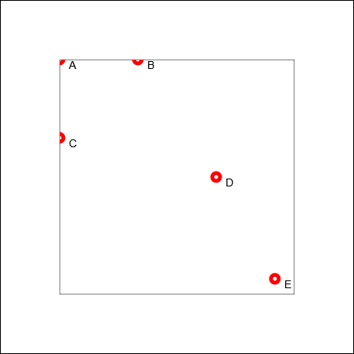

# Koordinatensystem
 
## Wie Computer "sehen"
 
Bevor wir anfangen zu zeichnen, müssen wir verstehen, wie Computer Positionen auf dem Bildschirm verstehen. Computer arbeiten mit einem **Koordinatensystem** – ähnlich wie du es aus der Mathematik kennst.
 
## Das Koordinatensystem
 
Computer denken zweidimensional in zwei Achsen:
- **x-Achse**: horizontal (von links nach rechts)
- **y-Achse**: vertikal (von oben nach unten)

:::caution Vorsicht
In der Mathematik beginnt das Koordinatensystem meist **unten links** mit dem Punkt (0, 0). Die y-Achse zeigt nach oben.
 
Bei Computern ist es andersherum, der **Nullpunkt (0, 0)** ist in der **oberen linken Ecke** und die **y-Achse** zeigt nach **unten**.
:::

### Beispiele
 
Schauen wir uns ein paar Positionen an:
 
| Name | Koordinaten  | Position auf dem Bildschirm             |
| ---- | ------------ | --------------------------------------- |
| A    | `(0, 0)`     | Ganz oben links                         |
| B    | `(100, 0)`   | 100 Pixel von links, ganz oben          |
| C    | `(0, 100)`   | Ganz links, 100 Pixel von oben          |
| D    | `(200, 150)` | 200 Pixel von links, 150 Pixel von oben |
| E    | `(275, 280)` | 275 Pixel von links, 280 Pixel von oben |
 
 
<!-- <BILD: Ein Canvas mit eingezeichneten Punkten an den Positionen aus der Tabelle, jeweils mit beschrifteten Koordinaten> -->