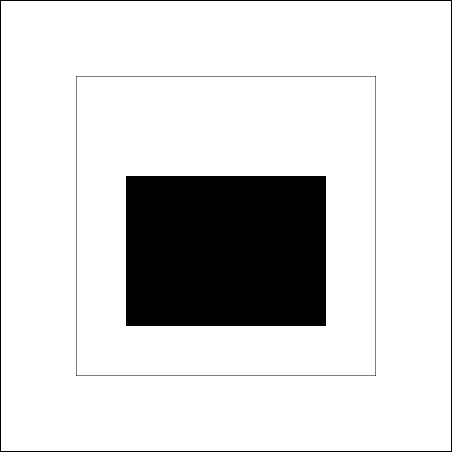
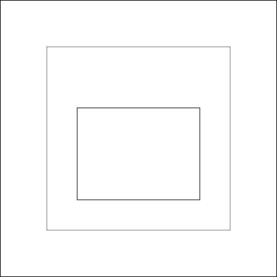
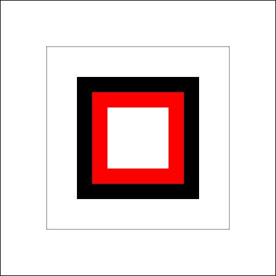
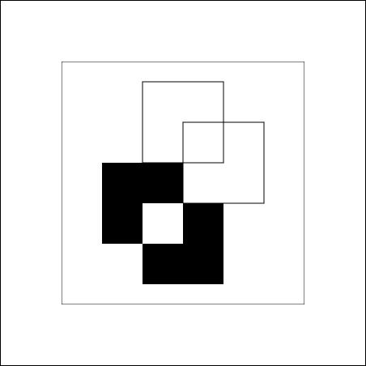

# Rechtecke

Rechtecke sind die einfachsten Formen, die wir mit der Canvas API zeichnen können.

## Die Rechteck-Funktionen

Die Canvas API bietet uns drei Funktionen zum Zeichnen von Rechtecken:

### 1. `fillRect()` - Ausgefüllte Rechtecke

```javascript
ctx.fillRect(x, y, breite, höhe);
```

Zeichnet ein **ausgefülltes** Rechteck. Wir kümmern uns um die Farbe in Kapitel 3. Ohne weitere Angaben wird in Schwarz gezeichnet.

**Parameter:**
- `x`: x-Koordinate der **oberen linken Ecke**
- `y`: y-Koordinate der **oberen linken Ecke**
- `breite`: Breite des Rechtecks in Pixeln
- `höhe`: Höhe des Rechtecks in Pixeln

**Beispiel:**
```javascript
ctx.fillRect(50, 100, 200, 150);
```

Dies zeichnet ein schwarzes Rechteck:
- Obere linke Ecke bei (50, 100)
- 200 Pixel breit
- 150 Pixel hoch

 
### 2. `strokeRect()` - Rechteck-Umriss

```javascript
ctx.strokeRect(x, y, breite, höhe);
```

Zeichnet **nur die Umrandung** eines Rechtecks (nicht ausgefüllt).

**Beispiel:**
```javascript
ctx.strokeRect(50, 100, 200, 150);
```
 

### 3. `clearRect()` - Rechteck löschen

```javascript
ctx.clearRect(x, y, breite, höhe);
```

**Löscht** einen rechteckigen Bereich (macht ihn transparent).
:::info Info
Canvas funktioniert anders als Photoshop nicht mit Ebenen, sonder speichert immer nur die oberst zu sehenden Pixel ab.

Deshalb legen Funktionen wie clearRect zuvor gemalte Pixel **nicht** wieder frei, sondern setzen den Hintergrund in seinen Ursprungszustand zurück.
:::
**Beispiel:**
```javascript
    ctx.fillRect(50, 50, 200, 200);  // Großes Rechteck zeichnen
    ctx.fillStyle = 'red';  // Fill Farbe
    ctx.fillRect(75, 75, 150, 150);  // Zweites Rechteck übermalen
    ctx.clearRect(100, 100, 100, 100);  // Loch in die Mitte schneiden
```
 


## Position vs. Größe verstehen

Wichtig zu verstehen:

- **Position** (`x`, `y`): Wo das Rechteck startet (obere linke Ecke)
- **Größe** (`breite`, `höhe`): Wie groß das Rechteck ist

```javascript
// Position: (100, 50)
// Größe: 200 x 100
ctx.fillRect(100, 50, 200, 100);
```

Das Rechteck:
- Startet bei x = 100
- Endet bei x = 100 + 200 = 300
- Startet bei y = 50
- Endet bei y = 50 + 100 = 150

## Übung 1: Dein erstes Rechteck

Öffne die `App.js` Datei in deinem Template und finde die `draw` Funktion. Versuche folgendes zu zeichnen:

**Aufgabe:** Male ein Rechteck, 400 x 300 groß, an Position (50, 100)

<details>
<summary>Lösung anzeigen</summary>

```javascript
function draw(ctx) {
  ctx.fillRect(50, 100, 400, 300);
}
```

</details>

## Übung 2: Mehrere Rechtecke

**Aufgabe:** Male drei Rechtecke unterschiedlicher Größe auf dein Canvas. Experimentiere mit verschiedenen Positionen! 

## Übung 3: Ausgefüllt vs. Umriss

**Aufgabe:** Versuche das nachfolgende Bild möglichst genau zu replizieren. Was ist die geringste Anzahl an rectangle Komandos die du brauchst um das Bild zu replizieren.
 


