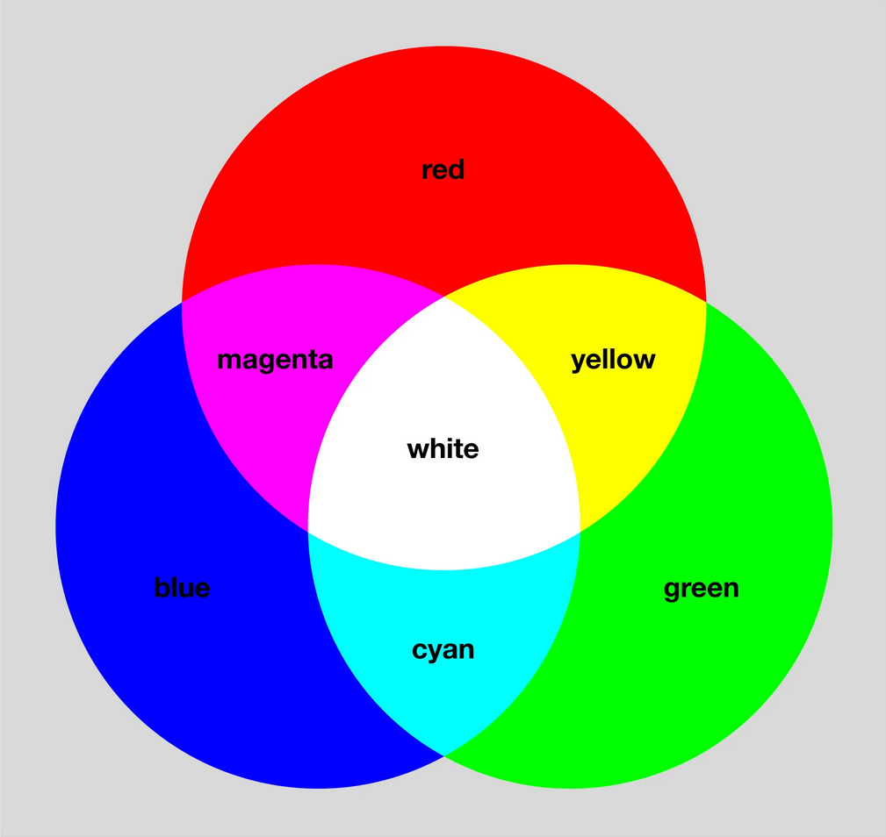
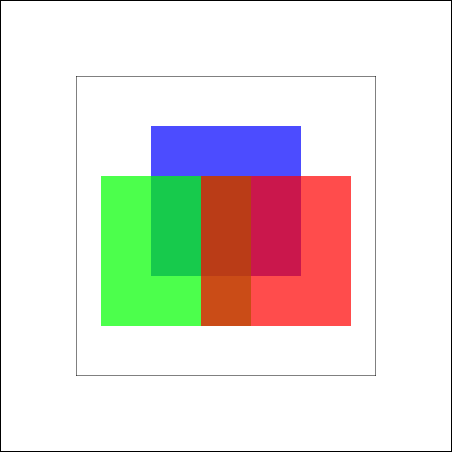
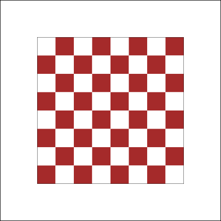
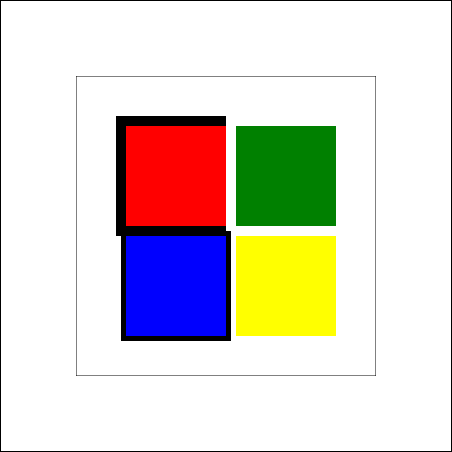

# Farben

Bis jetzt haben wir (fast) nur schwarze Rechtecke gezeichnet. Zeit, etwas Farbe ins Spiel zu bringen!

## Wie Computer Farben darstellen

Computer verwenden verschiedene Systeme, um Farben darzustellen. Das gängigste ist **RGB** - **R**ot **G**rün **B**lau.

### RGB - Additive Farbmischung

Eine Farbe besteht aus drei Zahlen, jeweils zwischen **0 und 255**:
- **R** (Rot): Wie viel Rot? (0 = kein Rot, 255 = maximales Rot)
- **G** (Grün): Wie viel Grün? (0 = kein Grün, 255 = maximales Grün)
- **B** (Blau): Wie viel Blau? (0 = kein Blau, 255 = maximales Blau)

**Wichtig:** RGB ist **additive Farbmischung** - wir mischen Licht, nicht Farbe!
- Alle Werte auf 0 → **Schwarz** (kein Licht)
- Alle Werte auf 255 → **Weiß** (maximales Licht)

 

<!-- <BILD: Darstellung der additiven Farbmischung mit drei überlappenden Kreisen (Rot, Grün, Blau), die in den Überlappungen Cyan, Magenta, Gelb und in der Mitte Weiß ergeben> -->

### Beispiele für RGB-Werte

| Farbe   | Rot | Grün | Blau | RGB-Notation         |
| ------- | --- | ---- | ---- | -------------------- |
| Rot     | 255 | 0    | 0    | `rgb(255, 0, 0)`     |
| Grün    | 0   | 255  | 0    | `rgb(0, 255, 0)`     |
| Blau    | 0   | 0    | 255  | `rgb(0, 0, 255)`     |
| Gelb    | 255 | 255  | 0    | `rgb(255, 255, 0)`   |
| Cyan    | 0   | 255  | 255  | `rgb(0, 255, 255)`   |
| Magenta | 255 | 0    | 255  | `rgb(255, 0, 255)`   |
| Weiß    | 255 | 255  | 255  | `rgb(255, 255, 255)` |
| Schwarz | 0   | 0    | 0    | `rgb(0, 0, 0)`       |
| Grau    | 128 | 128  | 128  | `rgb(128, 128, 128)` |

## Farben in Canvas setzen

In Canvas funktionieren Farben wie bei einem echten Pinsel:
1. Du **wählst eine Farbe** (tauchst den Pinsel ein)
2. Du **malst** mit dieser Farbe
3. Die Farbe bleibt aktiv, bis du sie wechselst

### `fillStyle` - Füllfarbe

Setzt die Farbe für **ausgefüllte** Formen:

```javascript
ctx.fillStyle = "rgb(255, 0, 0)";  // Rot wählen
ctx.fillRect(50, 50, 100, 100);     // Rotes Rechteck malen
```

### `strokeStyle` - Randfarbe

Setzt die Farbe für **Umrisse**:

```javascript
ctx.strokeStyle = "rgb(0, 255, 0)";  // Grün wählen
ctx.strokeRect(200, 50, 100, 100);   // Grüner Umriss
```

### Wichtig: Das Pinsel-Prinzip

```javascript
ctx.fillStyle = "rgb(255, 0, 0)";   // Pinsel in Rot tauchen
ctx.fillRect(50, 50, 100, 100);      // Rotes Rechteck
ctx.fillRect(200, 50, 100, 100);     // Noch ein rotes Rechteck!

ctx.fillStyle = "rgb(0, 0, 255)";   // Pinsel in Blau tauchen
ctx.fillRect(350, 50, 100, 100);     // Blaues Rechteck
```
 


## Verschiedene Farbnotationen

Canvas akzeptiert mehrere Arten, Farben anzugeben:

### 1. RGB
```javascript
ctx.fillStyle = "rgb(255, 100, 50)";
```

### 2. Hex-Farben
```javascript
ctx.fillStyle = "#FF6432";  // Gleiche Farbe wie oben
ctx.fillStyle = "#F00";     // Kurzform für #FF0000 (Rot)
```

### 3. Farbnamen
```javascript
ctx.fillStyle = "red";
ctx.fillStyle = "blue";
ctx.fillStyle = "green";
ctx.fillStyle = "yellow";
// ... und viele mehr
```

:::tip 
RGB gibt dir die meiste Kontrolle, Farbnamen sind am einfachsten für Standardfarben.
Eine vollständig Liste aller unterstützten Farb-Namen findest du im [MDN](https://developer.mozilla.org/en-US/docs/Web/CSS/Reference/Values/named-color)
:::
## RGBA - Transparenz

Mit **RGBA** kannst du Farben halbtransparent machen:

```javascript
ctx.fillStyle = "rgba(255, 0, 0, 0.5)";  // 50% transparentes Rot
```

Der vierte Wert (**Alpha**) liegt zwischen 0 und 1:
- `0` = komplett transparent (unsichtbar)
- `0.5` = halbtransparent
- `1` = komplett undurchsichtig

**Beispiel:**
```javascript
ctx.fillStyle = "rgb(255, 0, 0)";
ctx.fillRect(50, 50, 150, 150);

ctx.fillStyle = "rgba(0, 0, 255, 0.5)";  // 50% transparentes Blau
ctx.fillRect(100, 100, 150, 150);         // Überlappt das rote
```

<!-- <BILD: Zwei überlappende Rechtecke - ein undurchsichtiges rotes und ein halbtransparentes blaues, sodass man die Überlappung in Lila sieht> -->

## Übung 1: Bunte Rechtecke

**Aufgabe:** Male drei überlappende Quadrate in Rot, Grün, Blau mit jeweils 70 Prozent Transparenz
 

## Übung 2: Schachbrett

**Aufgabe:** Denke nochmal an die Übungen aus dem JS Tutorial zurück und male jetzt möglichst effizient ein Schachbrett auf das Canvas. Das Pattern sollte 8x8 Quadrate beinhalten, mit alternierenden Farben und dunklen Farben in der linken unteren Ecke. 
:::danger
64 mal ctx.fillRect zu kopieren, zählt nicht als Lösung für diese Übung 
:::
 

## Übung 3: Füllung und Rand

**Aufgabe:** Schreibe eine Funktion um ein Quadrat mit Rand zu zeichnen, die Position und Größe des Quadrats sowie die Dicke des Randes, als auch die Farbe des Quadrats und des Randes sollen jeweils als Parameter zu übergeben sein.
Nutze dann deine Funktion um das folgenden Bild zu rekonstruieren:

 

<details>
    <summary>Tip 1</summary>

    Zwei übereinanderliegende Rechtecke können den Eindruck eines Randes vermitteln.
</details>
<details>
    <summary>Tip 2</summary>

    Alle Quadrate haben eine Größe von 100 
</details>
<details>
    <summary>Tip 3</summary>

    3 von 4 Rändern sind schwarz und 3 von 4 Rändern haben eine positive Breite.
</details>
