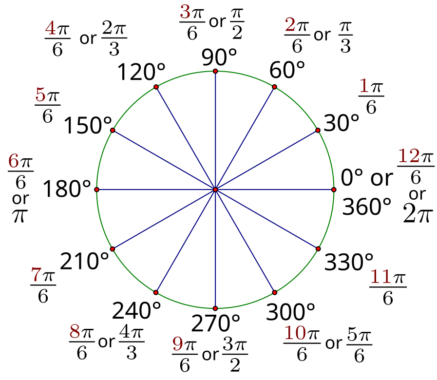
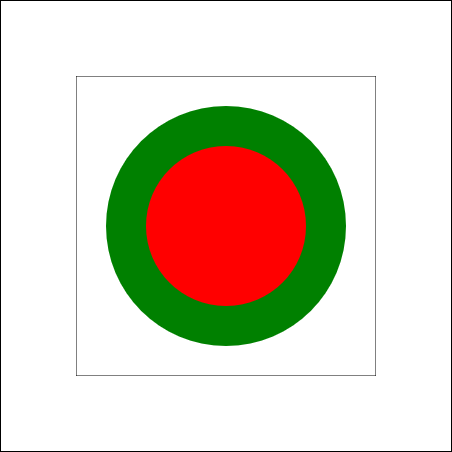
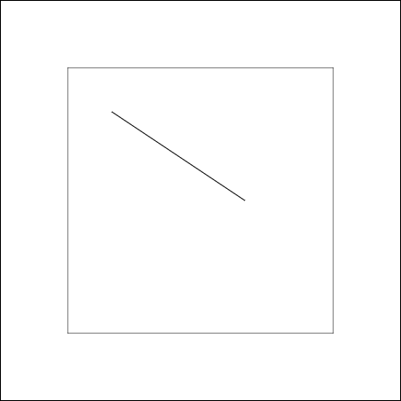
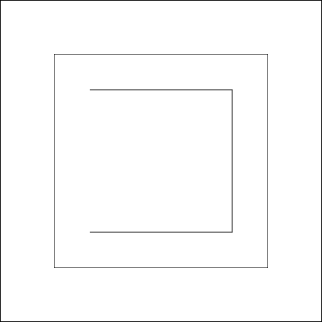
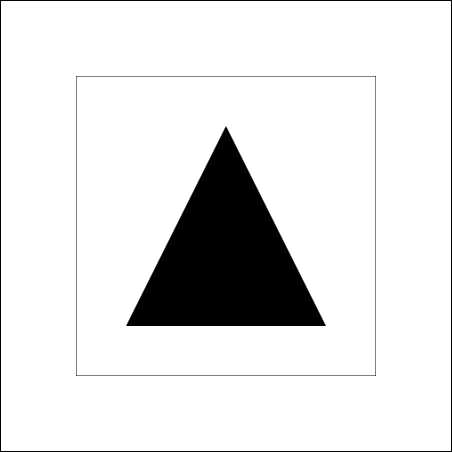
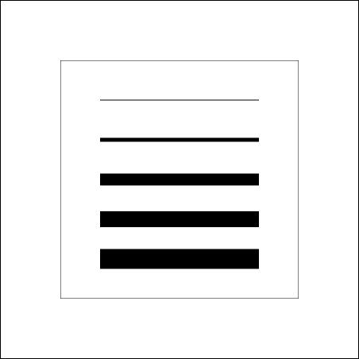
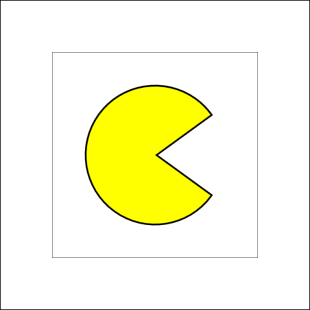

# Andere Formen

Rechtecke sind ein guter Start, aber für die meisten Grafiken brauchen wir mehr: Kreise, Linien, Dreiecke und andere Formen. Dafür gibt es in Canvas das Konzept der **Pfade** (Paths).

## Was ist ein Pfad?

Ein Pfad ist wie eine Linie, die du mit einem Stift zeichnest, ohne ihn abzusetzen. Du kannst:
1. Den Stift an einen Startpunkt setzen
2. Linien und Kurven zeichnen
3. Am Ende entscheiden: Soll die Form ausgefüllt oder nur der Umriss gezeichnet werden?

## Die Grundstruktur eines Pfads

```javascript
ctx.beginPath();        // 1. Neuen Pfad starten
// ... Pfad zeichnen ...
ctx.fill();            // 3a. Pfad ausfüllen
ctx.stroke();          // 3b. Pfad als Umriss zeichnen
```

**Wichtig:** 
- `beginPath()` startet immer einen neuen Pfad
- `fill()` füllt den Pfad aus
- `stroke()` zeichnet nur den Umriss

:::info
Du kannst auch nur fill oder stroke verwenden, falls du das andere nicht benötigst
:::

## Kreise zeichnen

Kreise zeichnet man mit `arc()`:

```javascript
ctx.arc(x, y, radius, startWinkel, endWinkel);
```

**Parameter:**
- `x`, `y`: Mittelpunkt des Kreises
- `radius`: Radius (Abstand vom Mittelpunkt zum Rand)
- `startWinkel`: Wo der Kreis beginnt (in Radiant)
- `endWinkel`: Wo der Kreis endet (in Radiant)

### Was sind Radianten?

Winkel werden in **Radiant** statt Grad angegeben:
- `0` = 0° (rechts)
- `Math.PI / 2` = 90° (unten)
- `Math.PI` = 180° (links)
- `2 * Math.PI` = 360° (voller Kreis)


 

### Einen vollen Kreis zeichnen

```javascript
ctx.fillStyle = "red";
ctx.strokeStyle = "green";
ctx.lineWidth = 40;

ctx.beginPath();
ctx.arc(150, 150, 100, 0, 2 * Math.PI);
ctx.fill();    // Erst füllen
ctx.stroke();  // Dann Rand zeichnen
```

Dies zeichnet einen rot ausgefüllten Kreis:
- Mittelpunkt bei (150, 150)
- Radius 100 Pixel
- Von 0 bis 2π (voller Kreis)
- Grüner Rand mit 40 Pixel

 

:::caution 
Die Reihenfolge von `fill()` und `stroke()` kann das Ergebnis beeinflussen!
:::
## Linien zeichnen

### Einfache Linie

```javascript
ctx.beginPath();
ctx.moveTo(50, 50);    // Startpunkt
ctx.lineTo(200, 150);  // Endpunkt
ctx.stroke();
```

- `moveTo(x, y)`: Setzt den "Stift" an eine Position (ohne zu zeichnen)
- `lineTo(x, y)`: Zieht eine Linie von der aktuellen Position zu (x, y)

 
### Mehrere verbundene Linien

```javascript
    ctx.beginPath();
    ctx.moveTo(50, 50);
    ctx.lineTo(250, 50);
    ctx.lineTo(250, 250);
    ctx.lineTo(50, 250);
    ctx.stroke();
```

 

### Geschlossene Form (Dreieck)

```javascript
ctx.beginPath();
ctx.moveTo(100, 50);   // Spitze oben
ctx.lineTo(50, 150);   // Ecke unten links
ctx.lineTo(150, 150);  // Ecke unten rechts
ctx.closePath();       // Zurück zum Start
ctx.fill();
```

- `closePath()` schließt den Pfad automatisch zum Startpunkt

 

## Linienbreite steuern
 
Mit `lineWidth` kannst du die Dicke von Linien und Umrissen ändern:
 
```javascript
ctx.lineWidth = 5;  // 5 Pixel breit
```
 
**Standard:** Die Standardbreite ist `1` Pixel.
 
### Beispiel: Unterschiedliche Linienbreiten
 
```javascript
ctx.strokeStyle = "black";
    ctx.lineWidth = 1;
    ctx.beginPath();
    ctx.moveTo(50, 50);
    ctx.lineTo(250, 50);
    ctx.stroke();

    ctx.lineWidth = 5;
    ctx.beginPath();
    ctx.moveTo(50, 100);
    ctx.lineTo(250, 100);
    ctx.stroke();

    ctx.lineWidth = 15;
    ctx.beginPath();
    ctx.moveTo(50, 150);
    ctx.lineTo(250, 150);
    ctx.stroke();
    
    ctx.lineWidth = 20;
    ctx.beginPath();
    ctx.moveTo(50, 200);
    ctx.lineTo(250, 200);
    ctx.stroke();

    ctx.lineWidth = 25;
    ctx.beginPath();
    ctx.moveTo(50, 250);
    ctx.lineTo(250, 250);
    ctx.stroke();
```
  

:::info
`lineWidth` bleibt aktiv wie `fillStyle` und `strokeStyle`. Setze es vor dem Zeichnen!
:::


## Übung: Pacman

**Aufgabe:** Nutze die Informationen aus diesem Kapitel, um Pacman zu zeichnen.

**Tip**: Du kannst Arcs und Lines kombinieren.

 
