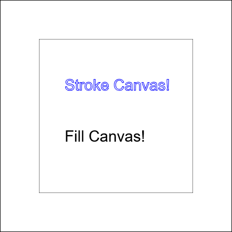
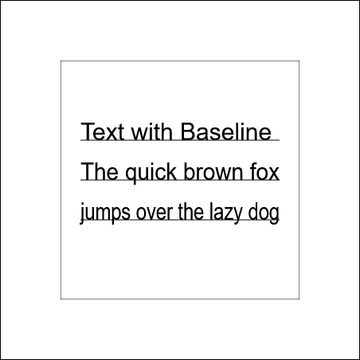
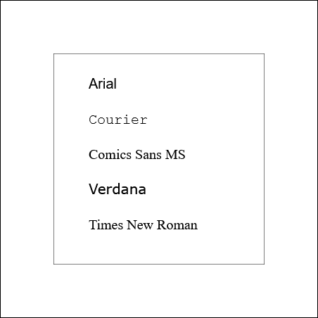
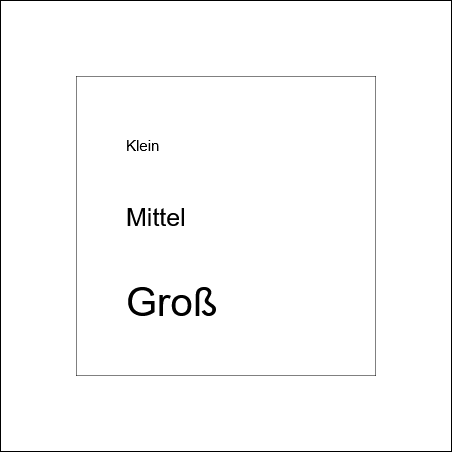
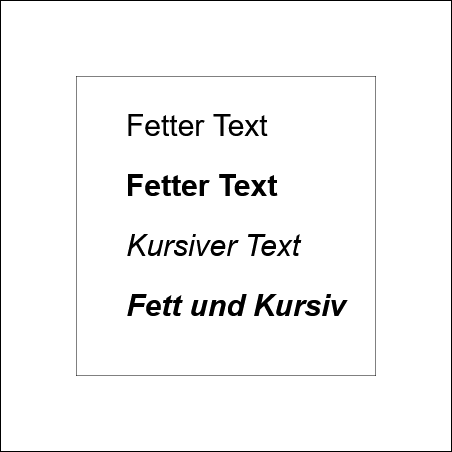
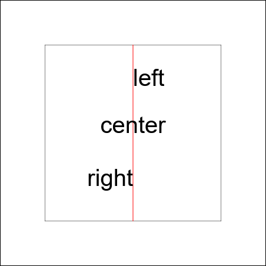
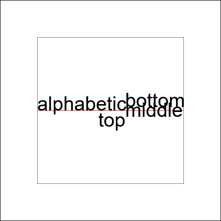
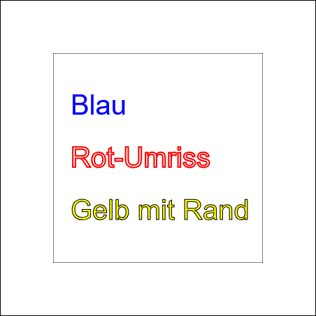
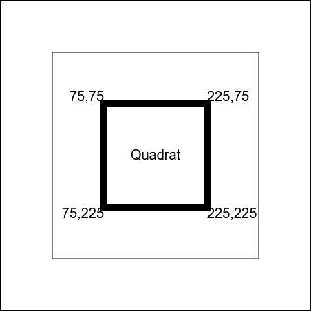
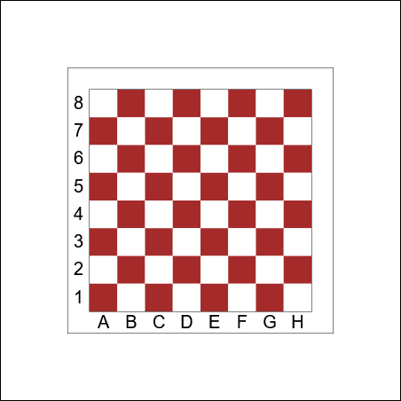

# Text

## Text auf dem Canvas

Neben Formen können wir auch Text auf dem Canvas zeichnen. Das ist besonders nützlich für Beschriftungen, Punktestände in Spielen oder Diagramme.

## Text zeichnen

Es gibt wieder zwei Funktionen zum Zeichnen von Text:

### 1. `fillText()` - Ausgefüllter Text

```javascript
ctx.fillText(text, x, y, maxWidth);
```

### 2. `strokeText()` - Text-Umriss

```javascript
ctx.strokeText(text, x, y, maxWidth);
```

Zeichnet nur den Umriss des Textes.

**Beispiel:**
```javascript
    ctx.strokeStyle = "blue";
    ctx.lineWidth = 1;
    ctx.strokeText("Stroke Canvas!", 50, 100);

    ctx.fillStyle = "black";
    ctx.fillText("Fill Canvas!", 50, 200);
```


## Wo ist der Text positioniert?

Die Koordinaten (x, y) geben an, wo die **Baseline** (Grundlinie) des Textes beginnt:
Die Breite maxWidth gibt an, wie breit der Text maximal sein darf. Wenn der Text länger ist wird er gestaucht.

```javascript
    ctx.fillText("Text with Baseline", 25, 100, 250);
    ctx.fillText("The quick brown fox", 25, 150, 250);
    ctx.fillText("jumps over the lazy dog", 25, 200, 250);
```

- `x = 100`: Text startet 100 Pixel von links
- `y = 100`: Die Grundlinie des Textes ist bei 100 Pixeln von oben

  

:::info
Der Text geht **nach oben** von dieser Linie. Buchstaben wie "g", "y", "p" gehen etwas nach unten.
:::

## Schriftart und -größe ändern

Mit `font` kannst du Schriftart und -größe festlegen:

```javascript
ctx.font = "30px Arial";
ctx.fillText("Großer Text", 50, 100);
```

Das Format ist: `"[Größe] [Schriftart]"`

### Beispiele für verschiedene Schriftarten

```javascript
ctx.font = "20px Arial";
ctx.fillText("Arial", 50, 50);

ctx.font = "20px Courier";
ctx.fillText("Courier", 50, 100);

ctx.font = "20px Comics Sans MS";
ctx.fillText("Comics Sans MS", 50, 150);

ctx.font = "20px Verdana";
ctx.fillText("Verdana", 50, 200);
```



### Verschiedene Größen

```javascript
    ctx.font = "15px Arial";
    ctx.fillText("Klein", 50, 75);

    ctx.font = "25px Arial";
    ctx.fillText("Mittel", 50, 150);

    ctx.font = "40px Arial";
    ctx.fillText("Groß", 50, 240);
```


<!-- <BILD: Drei Zeilen mit unterschiedlichen Schriftgrößen (15px, 25px, 40px)> -->

## Fett und Kursiv

Du kannst Text auch **fett** oder *kursiv* machen:

```javascript
    ctx.font = "30px Arial";
    ctx.fillText("Fetter Text", 50, 60);

    ctx.font = "bold 30px Arial";
    ctx.fillText("Fetter Text", 50, 120);

    ctx.font = "italic 30px Arial";
    ctx.fillText("Kursiver Text", 50, 180);

    ctx.font = "bold italic 30px Arial";
    ctx.fillText("Fett und Kursiv", 50, 240);
```



## Textausrichtung

Mit `textAlign` kannst du festlegen, wie der Text relativ zur x-Position ausgerichtet wird:

```javascript
ctx.textAlign = "left";    // Standard: Text startet an x
ctx.textAlign = "center";  // Text zentriert um x
ctx.textAlign = "right";   // Text endet bei x
```
### Vergleich der Ausrichtungen

```javascript
// Hilfslinie bei x=200
    ctx.strokeStyle = "red";
    ctx.lineWidth = 1;
    ctx.beginPath();
    ctx.moveTo(150, 0);
    ctx.lineTo(150, 400);
    ctx.stroke();

    ctx.fillStyle = "black";
    ctx.font = "40px Arial";

    ctx.textAlign = "left";
    ctx.fillText("left", 150, 70);

    ctx.textAlign = "center";
    ctx.fillText("center", 150, 150);

    ctx.textAlign = "right";
    ctx.fillText("right", 150, 240);
```



## Vertikale Ausrichtung

Mit `textBaseline` kannst du die vertikale Positionierung ändern:

```javascript
ctx.textBaseline = "top";       // y ist oben am Text
ctx.textBaseline = "middle";    // y ist in der Mitte
ctx.textBaseline = "bottom";    // y ist unten am Text
ctx.textBaseline = "alphabetic"; // Standard: Grundlinie
```

:::info
Meistens wirst du den den Standard  `alphabetic` verwenden, aber `top` ist nützlich wenn du y als Oberkante verstehen willst.
:::

```javascript
    // Hilfslinie bei y=150
    ctx.strokeStyle = "red";
    ctx.lineWidth = 1;
    ctx.beginPath();
    ctx.moveTo(0, 150);
    ctx.lineTo(300, 150);
    ctx.stroke();

    ctx.fillStyle = "black";
    ctx.font = "40px Arial";

    ctx.textBaseline = "alphabetic";
    ctx.fillText("alphabetic", 0, 150);

    ctx.textBaseline = "top";
    ctx.fillText("top", 125, 150);

    ctx.textBaseline = "bottom";
    ctx.fillText("bottom", 180, 150);

    ctx.textBaseline = "middle";
    ctx.fillText("middle", 180, 150);
```



## Farben bei Text

Text funktioniert wie Formen - mit `fillStyle` und `strokeStyle`:

```javascript
ctx.font = "40px Arial";

// Blauer ausgefüllter Text
ctx.fillStyle = "blue";
ctx.fillText("Blau", 50, 100);

// Roter Text-Umriss
ctx.strokeStyle = "red";
ctx.lineWidth = 2;
ctx.strokeText("Rot-Umriss", 50, 150);

// Beides kombiniert
ctx.fillStyle = "yellow";
ctx.strokeStyle = "black";
ctx.lineWidth = 3;
ctx.fillText("Gelb mit Rand", 50, 220);
ctx.strokeText("Gelb mit Rand", 50, 220);
```


## Übung 1: Text in einem Quadrat

**Aufgabe:** Male ein unausgefülltes Quadrat von 150 x 150 an mit 10px Rand. Schreibe das Wort "Quadrat" zentriet in die Mitte des Quadrats. Beschrifte die Ecken mit ihren Koordinaten, verwende dazu horizontale und vertikale Ausrichtung.


## Übung 2: Beschriftetes Schachbrett

**Aufgabe:** Gehe nochmal zu unserem Schachbrett zurück und zeichne am Rand für die Reihen die Zahlen und für die Spalten die Buchstaben ein.




