# Setup

Um mit dem Tutorial und damit auch mit dem Programmieren loszulegen, brauchst du zunächst ein paar Programme und Accounts. Diese setzen wir jezt zusammen auf. Das Setup welches wir hier zusammen einrichten wird genau so auch auf der Akademie selbst benutzt werden - es lohnt sich also, sich jetzt schon daran zu gewöhnen.

## 1 Github

Github ist eine Plattform auf der Code hoch- und runtergeladen werden kann. Wir stellen Code per Github zur Verfügung und werden auch im Kurs auf der Akademie mit Github arbeiten.

### 1.1 Account erstellen

Erstelle zunächst einen Github Account, falls du noch keinen hast. Klicke dazu [hier](https://github.com/signup), gib deine Email an und wähle ein Passwort und einen Nutzernamen aus.

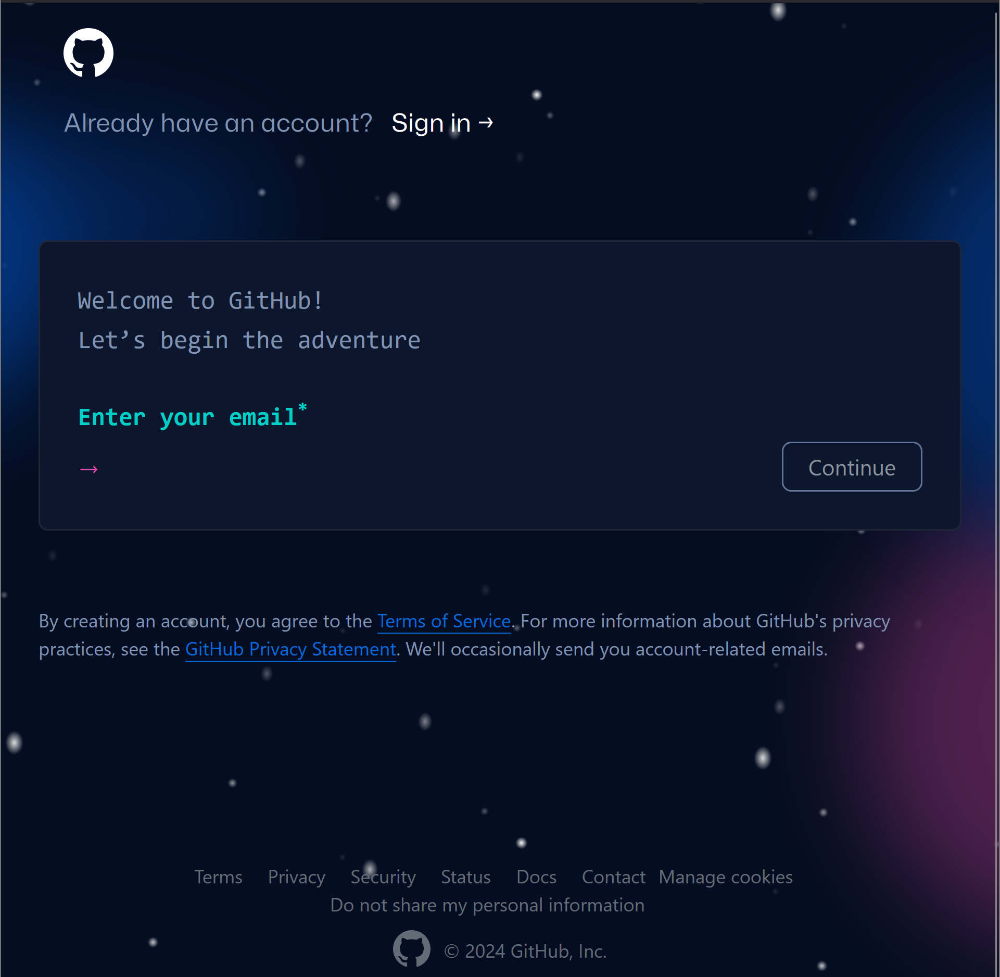

### 1.2 Repository forken

Sobald du deine Email verifiziert hast, kannst du eine Kopie des Tutorial Repositories erstellen, in dem du während der Vorbereitung arbeiten und deine Lösungen hochladen wirst. In Git nennt man diese Art von Kopie auch einen "Fork".

1. Öffne dazu die Github Seite des Repositories [hier](https://github.com/info-hsaka/javascript-template).
2. Drück auf den 'Fork'-Knopf 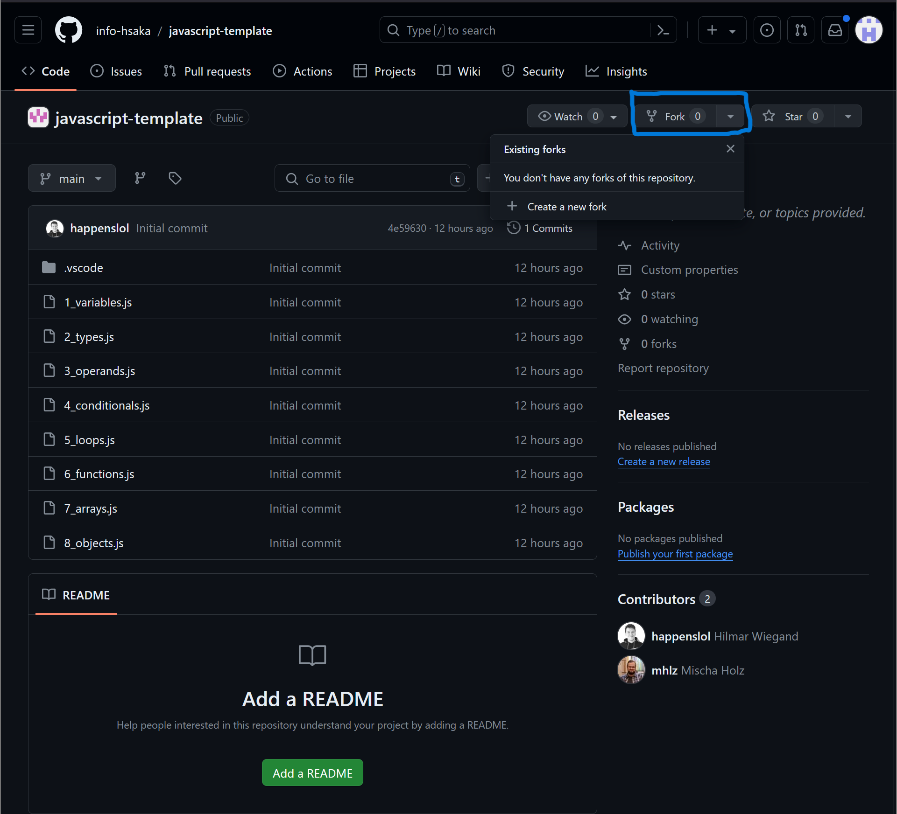 und lass alle Einstellungen auf ihren Defaultwerten. 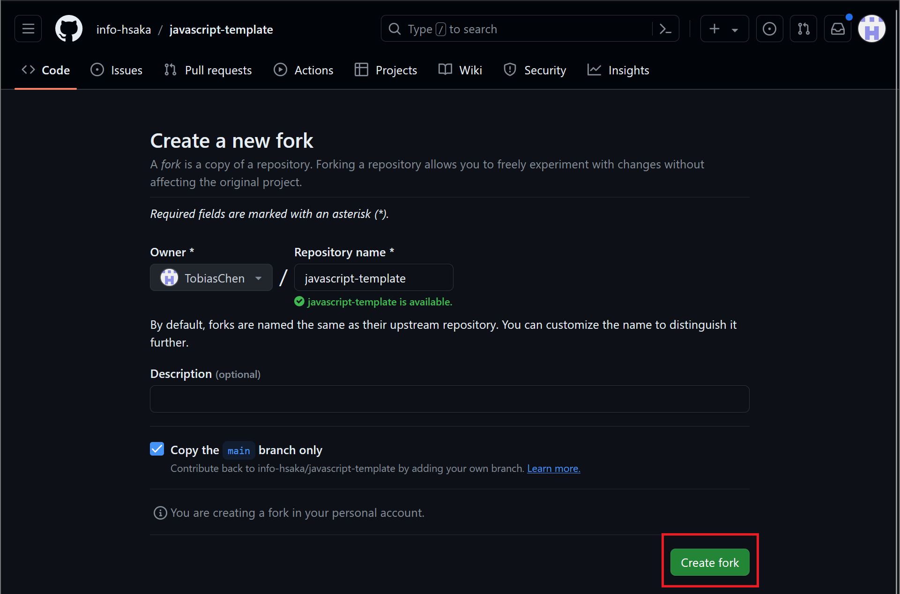
3. Wenn alles funktioniert hat, sollte nach 2-3 Sekunden folgender Screen zu sehen sein: 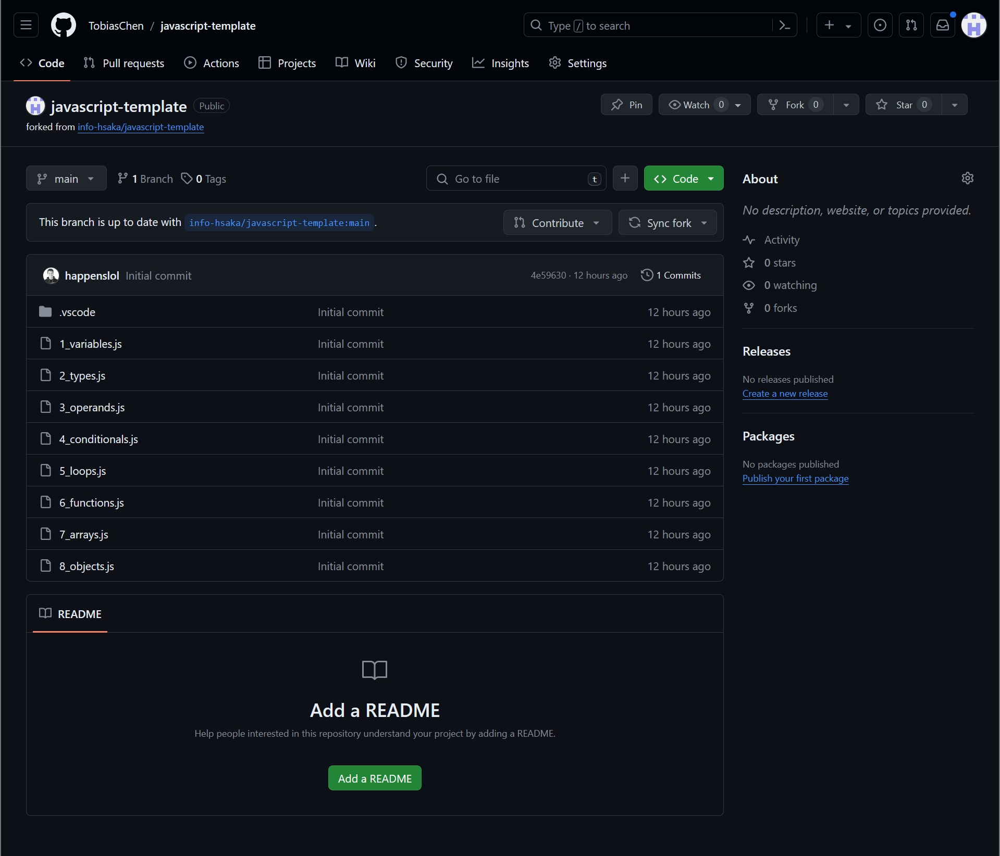

Du hast jetzt eine Kopie des Repositories, als nächstes setzen wir VSCode auf und laden das Repo herunter, damit du mit dem Tutorial loslegen kannst.

Merke dir die URL deines Repositories, da wir die später noch brauchen. Die URL sollte folgendes Format haben:

https://github.com/DEIN-USERNAME/javascript-template

## 2 VSCODE

VSCode ist unser Code Editor - ähnlich wie Word für Fließtext, nur für Code. Wir werden die meiste Zeit in VSCode verbringen.

### 2.1 VSCode installieren

Den Installer für VSCode kannst du [hier](https://code.visualstudio.com/Download) herunterladen. Sobald du VSCode installiert hast, solltest du folgenden Screen sehen: 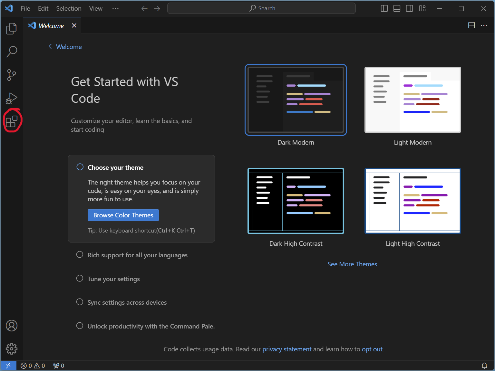

### 2.2 Extensions

Drücke zuerst auf den markierten "Extension" Button auf der linken Seite, um den Extension-Marktplatz zu öffnen. Hier kannst du nach Erweiterungen suchen um VSCode zu modifizieren.

#### Prettier

Prettier ist eine Extension, die unseren Code automatisch lesbar und einheitlich formatiert.

Suche und installiere die Extension `Prettier - Code formatter` von Prettier

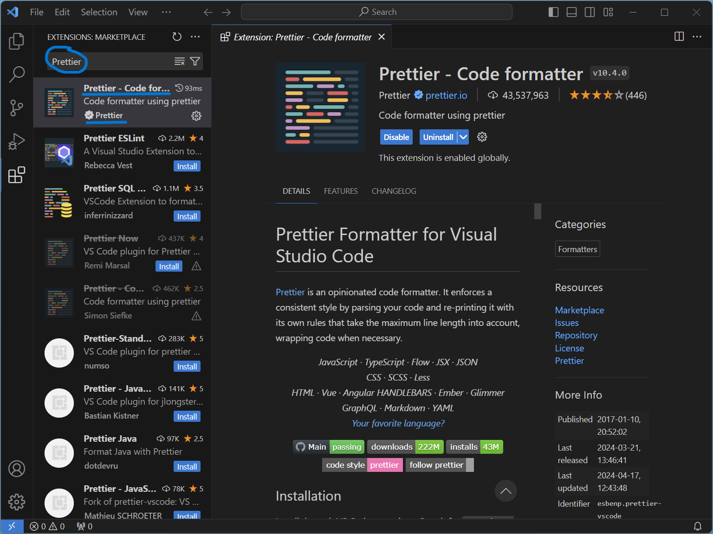

#### Git Graph

Git Graph erlaubt es uns, Code von Github zu laden und später auch hochzuladen.

Suche und installiere die Extension `Git Graph` von mhutchie

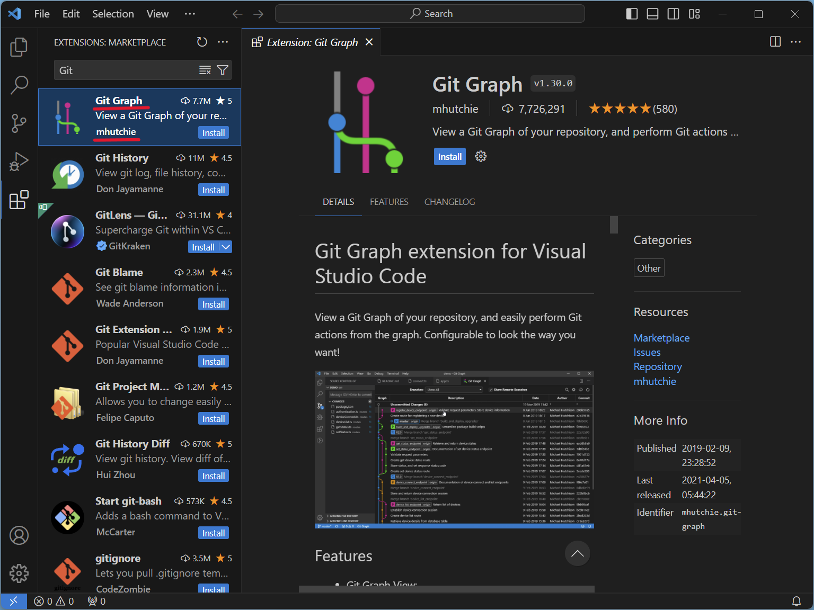

### 2.3 Clone Git Repository

Damit du endlich mit dem Tutorial loslegen kannst, musst du das vorhin geforkte Repo noch herunterladen. Drücke dazu erneut `Strg+Shift+P`/`Cmd+Shift+P`, und suche nach `Git: clone`.

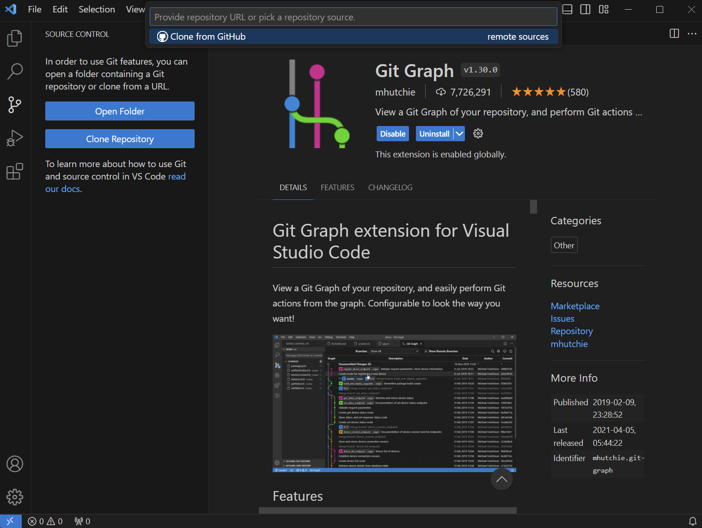

Drücke Enter, und gebe nun die URL deines geforkten Repositories an:

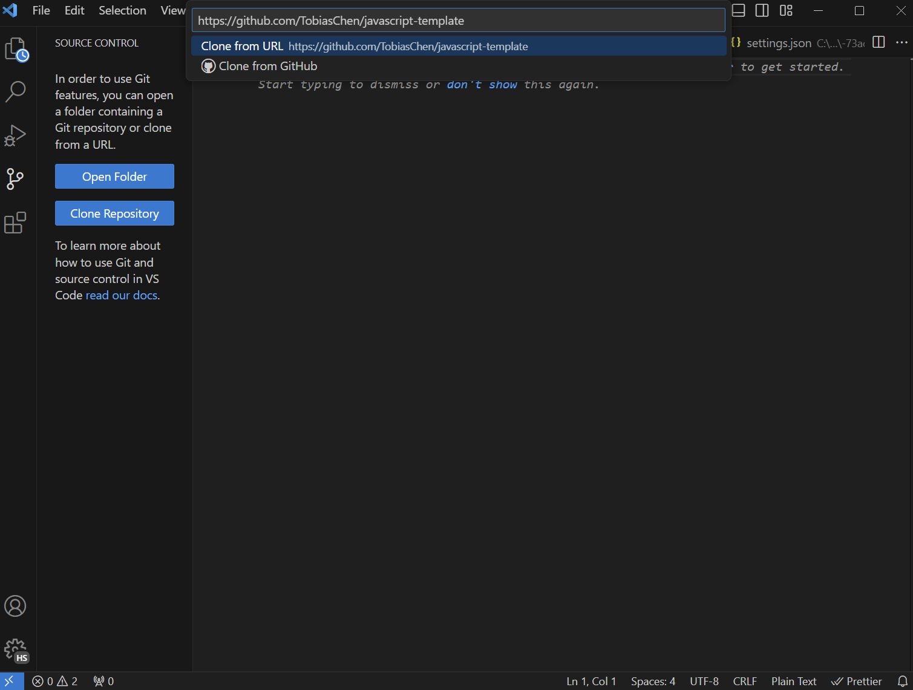

Noch einmal Enter, und du musst nur noch einen Ordner auf deinem Rechner angeben, in dem das Repository gespeichert werden soll. Such dir einen aus, der dir gut passt. Nach dem Herunterladen, fordert dich VSCode dazu auf das heruntergeladene Repo zu öffnen.

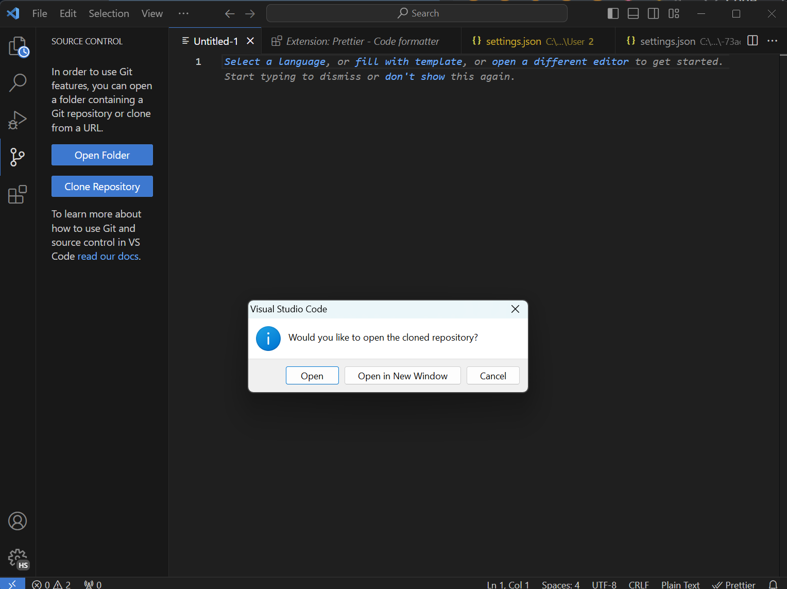

Eventuell musst du noch bestätigen, dass du den Erstellern des Repositories vertraust. Das tust du natürlich 😉

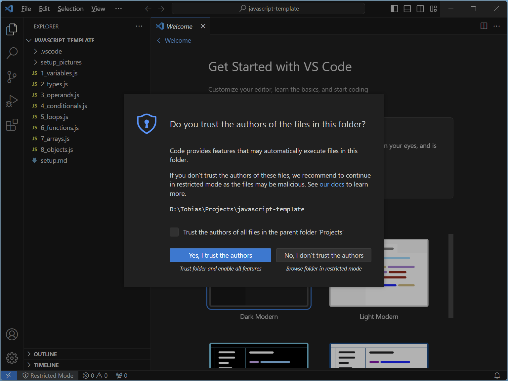

Jetzt bist du bereit loszulegen!
