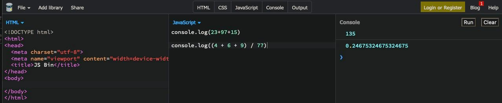
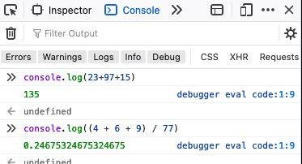
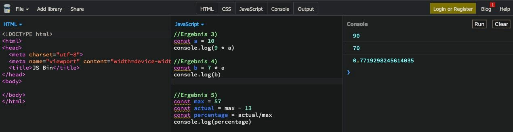
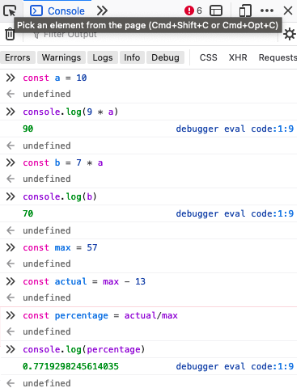

# Operands

## Overview

- Was sind operatoren?
- Welche Matheoperatoren gibt es?
- Was ist der Unterschied zwischen == und ===?
- Was sind Expressions?

## Mathoperands

Folgende Matheoperatoren existieren:

- Plus `+`
- Minus `-`
- Multiplizieren `*`
- Teilen `/`
- Restbestrand `%`
- Exponenten `**`

Restbestand (oder auch `remainder`) ist der Restbestand der Zahl, die nach Teilung
übrig bleibt.

```js
console.log(5 % 2); //1
console.log(8 % 3); //2
console.log(6 % 3); //0
```

## Stringverkettung (concatenation)

Manche Operatoren lassen sich ebenfalls auf strings anwenden.
Beispielsweise kann man strings 'addieren', um aus zwei strings einen zu machen in etwa
so wie wenn man aus einzelnen Worten Sätze bildet.

```js
let message = "Hallo" + "Welt!";
console.log(message); // Hallo Welt!
```

:::danger Strings and numbers
JS Operatoren konvertieren notfalls die Typen der Argumente, um die Operationen trotzdem
ausführen zu können.

Anders als bei `NaN` konvertiert ein Additionsoperator eine number in einen string:

```js
console.log("Hallo" / 2); //NaN

console.log(1 + "2"); //12
console.log(2 + "1"); //21

console.log(6 + 3 + 5 + "4"); //144
//wird der Reihe nach aufgelöst
// 6 + 3 = 9
// 9 + 5 = 14
// 4 + '4' = 144

console.log("1" + 2 + 2); //122
//hier wird bereits die erste operation zum string umgewandelt
// '1' + 2 = '12'
// '12' + 2 / = '122'
```

:::

Operatoren folgen wie in der Mathematik (Multipliation vor Addition) einer Präzedenz(Prioritäten) Reihenfolge durch
die bestimmt wird in welcher Reihenfolge Operationen ausgefühert werden.

Die gesamte Liste könnt ihr [hier](https://developer.mozilla.org/de/docs/Web/JavaScript/Reference/Operators/Operator_Precedence#tabelle)
einsehen.

Meistens werden ihr jedoch nicht in Situation kommen und falls doch, bietet es sich an die
Operation auf mehrere Schritter aufzuteilen, um Lesbarkeit zu gewähren und Fehler zu vermeiden.

:::tip Assignemnt =
Assignemnt `=` ist auch ein operator mit dem niedrigen Stellenwert von 2. Weshalb es möglich ist
Matheoperatoren während eines Assignments zu nutzen, z.b.

```js
let x = 2 * 2 + 1;
```

:::

## Expressions

Expressions ist jeder Ausdruck von Code der sich zu einem Wert auflösen lässt.

Dabei gilt es zu unterscheiden, ob die Expressions side effects haben oder nicht.
Side effects bedeuted in diesem Sinne, dass der Wert z.b. einer Variable assigned wird.
Ohne side effect wäre eine expression, wenn sie evaluiert und zu einem Wert ausgewertet
werden würde.

Das nachfolgende Beispiel besteht aus zwei expressions, eine mit side effect
und eine expression ohne:

```js
let x = 8;
```

`8` ist die reguläre Expression, die nur einen Wert darstellt.
`=` ist die side effect expression, die diesen Wert der Variable `x` assigned.

Das nächste Beispiel lösen sich zu einer Expression auf, da sie keiner Variable assigned wird.

```js
console.log(3 + 4);
```

JavaScript hat für Expressions folgende Kategorien:

- Arithmetisch - `3`, `3.232`
- String - `"a"`, `"Fred"`
- Logisch - `true` oder `false`
- Primary expressions - basic keywords z.b. `!`, `<`, `>`
- Left-hand-side expressions - dem Wert links wird der Endwert zugewiesen (assigment)

Der Kernessenz von Expressions ist somit, dass sie sich _immer_ zu einem Wert auflösen lassen.

## Coding

Dieser part ist optional. Falls ihr neu im programmieren seid, legen wir euch dringend nahe die übungen auszuprobieren und Dinge zu testen.
Hierbei ist alles freiwillig & geht zum nächsten part wenn ihr euch comfortable fühlt.

Nutzt hierfür die [playgrounds](../intro#intro) oder die [developer console](./variables#html) in eurem browser.

Vergesst dabei nicht `console.log()`:

1.  Addiere mindestens zwei Zahlen!
2.  Printe die Lösung von: `(4 + 6 + 9) / 77`

<details>
<summary>Lösung 1 & 2</summary>
Answer for 2. should be approximately 0.24675

Solutions on jsBin



Solutions with developer console



</details>

3. Deklariert `let a = 10` (returns `undefined`) und tippt dann `9 * a`
4. Gefolgt von `let b = 7 * a` und dann `console.log(b)`

:::info
Falls ihr die developer console benutzt habt, werden ihr gemerkt haben, dass nach einer Variablendeklaration `undefined`
zurückgegeben wird - das ist ein [return statement](https://developer.mozilla.org/de/docs/Web/JavaScript/Reference/Statements/return).
`return` wird im nächsten Part genauer besprochen grundsätzlich, bekommt ihr auf Variablendeklaration in der Console `undefined` zurück was euch davon abhält die deklarierte Variable zu updaten.
:::

5. Deklariert eine variable `max` mit dem Wert 57. Deklariert dann `actual` mit dem Wert
   `max - 13`, gefolgt von `percentage` mit dem Wert `actual/max`.
   Lass euch dann das Ergebnis für `percentage` ausgeben.

<details>
<summary>Lösung 3-5</summary>
Solutions on jsBin



Solutions with developer console



</details>
