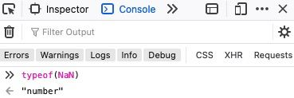

# Types

## Kernpunkte

- Welche Variablentypen gibt es?
- Was sind strings?
- Was sind numbers?
- Was sind booleans?
- Was ist null & undefined?

## Allgemein

Es gibt acht verschiedene Datentypen in JS. Diese werden unterschieden in sechs
`primitive values` und zwei `objects`.
Innerhalb part one schauen wir uns die [primitive values](https://developer.mozilla.org/de/docs/Glossary/Primitive) an.

## Numbers

In JS umfasst der `number` type zahlen, die integer sind (volle Zahlen) und floating point numbers(dezimalzahlen).
Ihr könnt sie assignen:

```js
const hoursPerYear = 8760; //Integer
const zeroKelvin = -273.15; //Floating point
```

Neben den regulären Zahlen gibt es nocht besondere Zahlentypen: `Infinity`, `-Infinity` und `NaN`.

`NaN` steht für 'not a number' und entsteht aufgrund von fehlerhaften Rechnungen, z.B.:

```js
alert("Hallo" / 2); //NaN, ein Wort ist nicht durch 2 teilbar
```

:::danger NaN is a number
Javascript hat kein type-checking, d.h. bei Matheoperationen die fehlerhaft sind, wird JS beim coden als auch beim ausführen keinen Fehler werfen. Stattdessen wird der Wert `NaN` als Ergebnis zurückgegeben.
Der Vorteil davon ist, dass unser code aufgrund einer fehlerhaften Matheoperation niemals einen fatalen Fehler zurückgeben wird.

Obwohl es für "not a number" steht, fällt `NaN` unter den typ `number`.


:::

:::note BigInt
Number types in JS können keine größeren Werte als (253-1) (9007199254740991), or weniger als -(253-1) anzeigen.
Dies hängt mit einer technischen Limitierung zusammen. Um größere Zahlen angeben zu können gibt es `BigInt` ihr könnt gerne [hier](https://developer.mozilla.org/en-US/docs/Web/JavaScript/Reference/Global_Objects/BigInt) oder [hier](https://javascript.info/bigint) mehr dazulesen.

Für die meisten Zwecke reicht jedoch der reguläre Number type, weshalb wir hier nicht weiter auf den `bigInt` type eingehen.
:::

## Strings

Strings sind Buchstaben umgeben von Anführungszeichen.
Es gibt drei Arten von Anführungszeichen

1.  Doulbe quote "Hello".
2.  Single quote 'Hello'.
3.  Backticks `Hello`.

Zwischen und double und single quotes, gibt es keinen Unterschied. Quotes müssen mit den gleichen
Anführungszeichen geschlossen werden, mit den sie geöffnet worden. z.B. "hello" -> 'Hello" geht nicht.

Backticks haben eine erweiterte Funktionalität. Sie erlauben uns sogenannte [template strings](https://developer.mozilla.org/de/docs/Web/JavaScript/Reference/Template_literals) zu erzeugen, die auf informationen von Variablen zugreifen und
einfache matheoperationen & conditionals zu benutzen.

Der Syntax dafür sieht so aus:

```js
let name = "Haki";
//eingebete variable
console.log(`Hello ${name}`); // Hello Haki
//
console.log(`the result is ${1 + 2}`); // the result is 3
```

:::info Console.log
[console.log](https://developer.mozilla.org/de/docs/Web/API/console/log) ist hier nur als Ersatz für alert.
Es ändert nichts an der Funktionsweise von template strings und gibt hier lediglich den wert in der console aus.
Oft ist es ein super simples tool um werte zu überprüfen um beim debugging von code zu helfen.
:::

## Boolean

Booleans können entweder `true`(wahr) oder `false`(falsch) sein.

Oft werden sie benutzt um weiteren code an eine Bedingung zu knüpfen, der nur
unter bestimmten Bedingungen ausgefuhert werden soll.

In Part 2 werden wir näher auf ihre Verwendung eingehen.

## Null & Undefined

`null` ist ein spezieller Wert, da er 'nichts', 'leer' oder 'wert ungewiss' darstellen soll.
In der Regel wird dieser Wert verwendet um einen Variablenwert explizit auf 'leer' zu setzen.

`undefined` hingegen ist der default value einer Variable, die deklariert wird, der aber noch kein Wert zugewissen wurde.

```js
let age;
alert(age); //shows 'undefined'
```

`undefined` verdeutlicht, dass der Variable bisher kein Wert zugewissen wurde. Während `null` benutzt werden kann um zu zeigen, dass die Variable bewusst 'leer' gelassen wird.

:::tip typeof
Der typeof operator `returned` den type des arguments, dass ihm übergeben wird. Dies ist oft hilfreich um type-checking
zu betreiben oder Datentypen zu überprüfen.

```js
const secondsInAMinute = 60;

typeof secondsInAMinute; // "number"

typeof 0; // "number"

typeof 10n; // "bigint"

typeof "foo"; // "string"

typeof true; // "boolean"

typeof undefined; // "undefined"
```

:::

:::note Symbols
Symbols fallen unter dem 'primitive value' type und werden hier für Vollständigkeit genannt. Sie ermöglichen
es einzigartige identifier für objects darzustellen. Da wir bisher `Objects` nocht nicht behandelt haben und die
Verwendung dieses Types relativ selten ist, wird er nicht weiter ausgeführt.
:::
