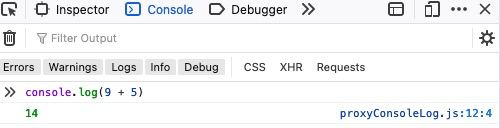

# Variablen & Deklaration

## Kernpunkte

- Wie deklariere ich eine variable?
- Tipps zur Benennung von Variablen?

## HTML

JavaScript kann in die [HTML](https://developer.mozilla.org/en-US/docs/Learn/Getting_started_with_the_web/HTML_basics) Struktur eines Documents
mithilfe von eines `<script>` tags eingefuegt werden.

```html
<!DOCTYPE html>
<html>
  <body>
    <p>Before the script...</p>

    <script>
      alert("Hello, world!");
    </script>

    <p>...After the script.</p>
  </body>
</html>
```

Output

```
    Before the script...

    ...After the script.
```

:::info Developer tools
Falls ihr keinen der genannten [playgrounds](./intro#playgrounds) nutzen moechtet, koennt ihr JavaScript ebenfalls in eurem Browser ausfuehren.
Dazu muesst oeffnet ihr die Developer Tools in eurem browser ([Anleitung fuer jeden browser hier](https://javascript.info/devtools)) und
dort in der console javascript befehle eingeben.


:::

## Variablen

Variablen sind benannte Speicher, die mit beliebigen Informationen befuellt werden koennen.
Um eine variable zu erzeugen benutzen wir das `let` keyword.

```js
let message;
```

Um `message` einen Wert zuzuweisen nutzen wir den assigment operator `=`.

```js
let message;

message = "Hallo"; //Wir weisen message das Wort 'Hallo' zu.
```

`message` enthaelt nun das Wort 'Hallo' und wir koennen auf diese Information ebenfalls zugreifen. Hierfuer nutzen wir eine
eingebaute browserfunktion - [alert](https://www.w3schools.com/jsref/met_win_alert.asp).

```js
let message;
message = "Hallo";

alert(message); //alert ruft den wert von message auf
```

Um effizienter zu sein, koennen wir einer variable bereits bei ihrer Erstellung einen Wert zuweisen.

```js
let message = "Hallo";
alert(message); //Hallo
```

Wir koennen auch mehrere variablen auf einmal erzeugen und Werte zuweisen.

```js
let user = "Alyx",
  age = 15,
  message = "Hey";
```

:::caution Komma
Die Kommas am Ende der Zeile verbinden die Zeilen, waere hinter `Alyx,` kein Komma, wuerde der danachstehende syntax
nicht funktionieren und beim ausfuehren einen Fehler werfen.
:::
