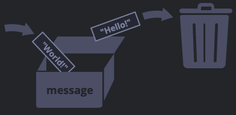

# Deklaration

## Kernpunkte

- JavaScript ausführen?
- Wie deklariere ich eine variable?
  - `let`
  - `const`
  - `var`

## HTML

JavaScript kann in die [HTML](https://developer.mozilla.org/en-US/docs/Learn/Getting_started_with_the_web/HTML_basics) Struktur eines Documents
mithilfe von eines `<script>` tags eingefügt werden.

```html
<!DOCTYPE html>
<html>
  <body>
    <p>Before the script...</p>

    <script>
      console.log("Hello, world!");
    </script>

    <p>...After the script.</p>
  </body>
</html>
```

Output

```
    Before the script...

    ...After the script.
```

:::info Developer tools
Falls ihr keinen der genannten [playgrounds](../intro#playgrounds) nutzen möchtet, könnt ihr JavaScript ebenfalls in eurem Browser ausführen.
Dazu müsst öffnet ihr die Developer Tools in eurem browser ([Anleitung für jeden browser hier](https://javascript.info/devtools)) und
dort in der console javascript befehle eingeben.


:::

:::info Console.log
[console.log](https://developer.mozilla.org/de/docs/Web/API/console/log) gibt hier lediglich den wert in der console aus.
Oft ist es ein super simples tool um werte zu überprüfen um beim debugging von code zu helfen.
:::

## Let

Variablen sind benannte Speicher, die mit beliebigen Informationen befüllt werden können.
Um eine variable zu erzeugen benutzen wir das `let` keyword.

```js
let message;
```

Um `message` einen Wert zuzuweisen nutzen wir den assigment operator `=`.

```js
let message;

message = "Hallo"; //Wir weisen message das Wort 'Hallo' zu.
```

`message` enthält nun das Wort 'Hallo' und wir können auf diese Information ebenfalls zugreifen. Hierfür nutzen wir eine
eingebaute browserfunktion - [console.log](https://www.w3schools.com/jsref/met_console_log.asp).

```js
let message;
message = "Hallo";

console.log(message); //console.log gbit den wert von message aus
```

Um effizienter zu sein, können wir einer variable bereits bei ihrer Erstellung einen Wert zuweisen.

```js
let message = "Hallo";
console.log(message); //Hallo
```

Wir können auch mehrere variablen auf einmal erzeugen und Werte zuweisen.

```js
let user = "Alyx",
  age = 15,
  message = "Hey";
```

:::caution Komma
Die Kommas am Ende der Zeile verbinden die Zeilen, wäre hinter `Alyx,` kein Komma, würde der danachstehende syntax
nicht funktionieren und beim ausführen einen Fehler werfen.

Generell ist es leicht so etwas zu übersehen und lässt sich oft durch expliziten syntax (einzelne `let`'s zu schreiben) vermeiden.
:::

## Analogy

Zur Veranschaulichung: Variablen sind 'behälter' für daten, mit einer einzigartigen
Beschriftung.
In unserem Beispiel haben wir einen Karton mit dem Namen 'message' mit dem Wert 'Hallo'.


Wir können beliebige Werte in den Karton tun und diese auch wechseln:

```js
let message = "Hallo";
message = "Welt"; //Wert hat sich geändert
console.log(message);
```

Wenn wir den Wert ändern(updaten), wird der alte Wert von der variable entfernt.



Wir können ebenfalls Werte von Variablen an andere Variablen weitergeben:

```js
let hello = "Hallo Welt!";
let message;
message = hello;
console.log(hello); //Hallo Welt!
console.log(message); //Hallo Welt!
```

:::danger Zweifache deklaration
Variablennamen sind einzigartig, falls der gleiche Name erneut verwendet wird, wirft dies einen Fehler.

```js
let message = "Hallo";
let message = "Welt!"; //SyntaxError: 'message' has already been declared.
```

:::

## Const

Eine weitere Option zur Erzeugung von Variablen ist das `const` keyword.

```js
const message = "Hallo";
```

`const` deklariert 'konstante' Variablen. Im Unterschied zu `let` ist der Variablenwert
einer `const` Variable nicht updatebar.

Wenn wir uns sicher sind, dass der Wert eine Variable sich nicht verändern wird oder _soll_ dann verwenden wir `const`

Der Versuch eine `const` Variable zu updaten führt zu einem Fehler:

```js
  const myBirthday: '18.04.2006'

  myBirthday = '01.01.2010' // error, can't reassign the constant!
```

:::info var
In altem javascript code wird oft das keywoard `var` anstelle von `let` verwendet. Generell benutzt man heute kein `var` mehr und findet das keyword
nur noch in outdated code, hier wird es nur der vollständigkeitshalber erwähnt.

```js
var message = "Hallo";
```

`var` hat einige [pitfalls](https://javascript.info/var), weshalb heutzutage nahezu ausschlieslich `let` oder `const` zur Erzeugung von Variablen verwendet werden.
:::
