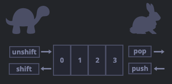

# Arrays & built-in methods

## Kernpunkte

- Was sind Arrays?
- Was sind built-in methods?
- Was für methods existieren?
- Wo finde ich eine Übersicht für methods?
- Wie loope ich über ein Array?

## Arrays

Array ist der letzte Datentyp von den acht.

Sie bieten uns ebenfalls die Möglichkeit eine Ansammlung von
Informationen in einem kodierten Format zu speichern.

Der wichtige Unterschied ist hierbei, dass Arrays eine feste
Reihenfolge der Werte mitspeichert.

Anders als in `Objects` sind gespeicherte Datenwerte in Arrays
nicht über `keys` aufrufbar, sondern über die ihre
gespeicherte 'Position'.

## Declaration

Es gibt zwei Arten `Arrays` zu deklarieren:

```js
let arr = []; // array literal - go to method

let arr = new Array(); // "Array constructor" - wenig genutzt
```

Bei der Deklaration können wir direkt Werte übergeben:

```js
let fruits = ["Apple", "Orange", "Plum"];
```

**Die Positionszahlen bei Arrays fangen bei `0` an.**

Wollen wir auf Daten zugreifen nutzen wir folgenden Syntax:

```js
let fruits = ["Apple", "Orange", "Plum"];

console.log(fruits[0]); // Apple
console.log(fruits[1]); // Orange
console.log(fruits[2]); // Plum
```

Falls wir Werte ersetzen wollen:

```js
fruits[2] = "Pear"; // replace Value on position 2
console.log(fruits); // ["Apple", "Orange", "Pear"]
```

Wenn wir Werte hinzufügen wollen nutzen wir dafür [push](https://developer.mozilla.org/de/docs/Web/JavaScript/Reference/Global_Objects/Array/push):

```js
fruits.push("Lemon"); //Array:
console.log(fruits); //["Apple", "Orange", "Pear", "Lemon"]
```

Wenn wir die Anzahl der gespeicherten Elemente(Werte)
innerhalb eines Arrays wissen möchten, erfahren wir dies
über die seine `lenght`:

```js
let fruits = ["Apple", "Orange", "Plum"];
console.log(fruits.length); //3

let emtpy = [];
console.log(empty.length); //
```

Wie `Objects` können Arrays jeden Datentyp speichern,
meist werden sie jedoch zum speichern für `primitive` types
verwendet.

Wenn wir den Wert des letzten Elements eines erfahren möchten,
müssen wir beachten, dass Arrays anfangen bei `0` zu
zählen:

```js
let fruits = ["Apple", "Orange", "Plum"];
let lengthOfFruits = fruits.length; // 3
//lengthOfFruit ist hier 3, dmait ist die Expression in den Klammern folgende:
// [3 - 1]  was zu [2] ausgewertet wird und uns erlaubt auf das letzte
// Element des arrays zuzugreifen
console.log(fruits[lengthOfFruits - 1]); //Plum
```

Würden wir `-1` nicht abziehen würde uns das Array
`undefined` zurückgeben, da sich an der Position `fruits[3]`
kein Wert befindet.

## Built-in methods

So wie wir `console.log`, `prompt` und andere `methods` bereits
benutzt haben. Existiert für Arrays eine ganze Reihe
von built-in `methods`.

D.h. diese `methods` sind in JavaScript miteingebaut und erleichtern
euch gängige Operationen zur Variablenmanipulation.

Wir werden hier über `pop, push, shift` und `unshift` reden - eine ausführlichere Liste findet [hier](./arrays.md#all-built-in-methods).

- `push` fügt dem Array am Ende ein weitere Element hinzu (wie oben gesehen)

```js
let fruits = ["Apple", "Orange"];

fruits.push("Pear"); // fügt "Pear" am Ende hinzu

console.log(fruits); // Apple, Orange, Pear
```

- `unshift` fügt dem Array am Anfang ein weiteres Element hinzu, alle
  anderen Elemente rücken um eine Position nach hinten.

```js
let fruits = ["Orange", "Pear"];

fruits.push("Apple"); // fügt "Apple" am Anfang hinzu

alert(fruits); // Apple, Orange, Pear
```

- `shift` entfernt das 1. Element (Position 0) und lässt alle anderen
  Elemente eine Position aufrücken.

```js
let fruits = ["Apple", "Orange", "Pear"];

fruits.shift(); // entfernt "Apple" am Anfang

console.log(fruits); // Orange, Pear
```

- `pop` entfernt das letzte Element eines Arrays.

```js
let fruits = ["Apple", "Orange", "Pear"];

fruits.pop(); // entfernt "Pear" am Ende

console.log(fruits); // Apple, Orange
```

:::danger Perfomance
Diese built-in methods sind unterschiedlich performant,
dies wird erst ein Thema wenn man mit sehr großen
Datensätzen arbeitet.

`Pop` und `push` sind schnell, weil sie nur Elemente
am Ende des Arrays verändern, das restliche Array (
alle Werte davor) wird nicht berührt.

`Shift` und `unshift` hingegen verändern ALLE
Elemente innerhalb des Arrays. D.h. je größer
das Array, desto mehr Elemente müssen um eine
Position nach vorne oder nach hinten verschoben werden.



:::

## All built-in methods

:::tip Liste aller built-in array methods
Eine Liste aller built-in array methods findet ihr [hier in der seitenleiste](https://developer.mozilla.org/de/docs/Web/JavaScript/Reference/Global_Objects/Array/concat),
ebenfalls
[hier](https://www.w3schools.com/js/js_array_methods.asp) und
die wichtigstens mit Beispielen nochmal [hier](https://javascript.info/array-methods) .
:::

## Loops with Arrays

Um über die Elemente eines Arrays zu loopen,
gibt es die Möglichkeit einen `for` zu nutzen
oder die `forEach` method.

Dies geht mit dem bereits bekannten syntax von dem
Kapitel zu [loops](../part-two/loops.mdx#for-loop)

```js
let arr = ["Apple", "Orange", "Pear"];

for (let i = 0; i < arr.length; i++) {
  // da sich i mit jeder iteration erhöht,
  // können wir den Wert nutzen um dynamisch
  //über die Werte des Arrays zu iterieren.
  console.log(arr[i]);
  //1. iteration - 'Apple'
  //2. iteration - 'Orange'
  //3. iteration - 'Pear'
}
```

Für Arrays gibt es jedoch eine Vereinfachung:

```js
let fruits = ["Apple", "Orange", "Plum"];

//fruit ist hier nur ein placeholder wort
for (fruit of fruits) {
  console.log(fruit);
  //1. iteration - 'Apple'
  //2. iteration - 'Orange'
  //3. iteration - 'Pear'
}
```

Da wir aber nicht jedes Mal einen `for loop` schreiben
möchten enthählt JS mehere loop methods.
Eine davon ist `forEach`:

```js
let fruits = ["Apple", "Orange", "Plum"];

//fruit ist hier wieder ein placeholder Wort
fruits.forEach((fruit) => console.log(fruit));
//1. iteration - 'Apple'
//2. iteration - 'Orange'
//3. iteration - 'Pear'
```

`=>` ist eine `Arrow function`, über die wir im [nächsten Kapitel](./special%20functions.md/#arrow-functions) mehr erfahren werden.
