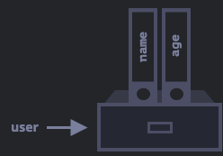
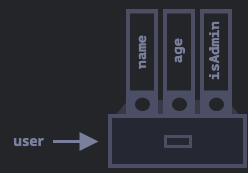
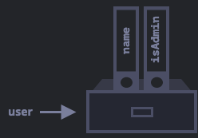
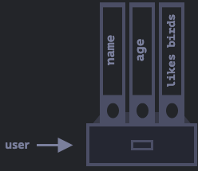
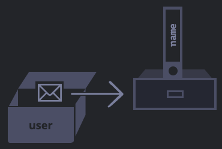

# Objects

## Kernpunkte

-   Was sind Objekte?
-   Wie deklariere ich ein Objekt?
-   Wie füge/lösche ich properties?
-   Wie greife ich auf Daten zu?
-   Wie kopiere ich Objekte?

## Objects

Im Kapitel [Typen](../part-one//types.md) haben wir bereits 6 von 8 datentypen kennengelernt. Die letzten beiden Typen
sind `Objects` und `Arrays` (behandelt nächsten chapter).

`Primitive` typen erlauben es nur einen Wert/Information in
einer Variable zu speichern( ein string, eine number, usw.).

Im `Objects` hingegen enhalten eine Sammlung von Informationen
Um ein Objekt zu deklarieren nutzen wir geschwungene Klammer (`{...}`). In diesen Klammern befinden sich so genannte `key: value` pairs - ein`key` ist immer ein string während der `value` ein beliebiger datentype sein kann.

Wir können uns Objekte als einen Aktenschrank vorstellen,
der beschriebene Ordner enthält.
Dadurch ist einfach Informationen durch den Ordnernamen zu finden, Ordner hinzuzufügen oder zu entfernen.


Ein leeres object("leerer Aktenschrank") kann auf zwei Weisen
deklariert werden:

```js
//1
let user = {} // "object literal" syntax - go to method
//2
let user = new Object() // "object constructor" syntax
```


## Literals and properties

Bei der Deklaration können wir auch gleich Informationen als
`key: value` pairs (auch 'properties' genannt) speichern.

```js
// object literal syntax
let user = {
    name: "John", // key: 'name' mit dem Wert "John"
    age: 30, //key: 'age' mit dem Wert 30
}
```

Eine `property` hat immer einen `key` (als 'identifier')
dann einen Doppelpunkt `:`, gefolgt von dem Wert, der
gespeichert werden soll.

Hier in unserem `user` object, haben wir zwei properties:

1. `name` mit dem wert `john`.
2. `age` mit dem Wert `30`.

Unser Aktenschrank sieht nun folgendermaßen aus:



Wir können jederzeit weitere Properties hinzufügen oder
entfernen.

Um auf eine Object property zugreifen zu können, benutzen
wir `.`:

```js
//gib den wert der properties aus:
console.log(user.name) // "John"
console.log(user.age) // 30
```

`Value` können jeder datentype sein:

```js
user.isAdmin = true
```



Um eine property zu entfernen können wir den `delete` operator
nutzen:

```js
delete user.age
```



Wir können auch mehrere Wörter als `key` nutzen, dafür müssen wir den string in Anführungszeichen setzen:

```js
let user {
    name: "John",
    age: 30,
    "likes brids": true // mehrere Wörter mit dem Wert true
}
```



Um einen `key` aus mehreren Wörtern aufrufen zu können,
müssen wir eckige klammern benutzen `[]`.

```js
user["likes birds"] //works

//ohne eckige Klammern, erhalten wir einen Fehler
user.likes birds //error
```

:::caution Multiword keys
Im allgemeinen sind multiword keys discouraged, weil sie eine
besondere Handhabung bedürfen.

Falls ihr einem `key` mehrere Wörter zuweisen möchtet, solltet ihr stattdessen camelCases verwenden, z.b.:

```js
let user = {
    likesBirds: true,
}
```

:::

Hinter jedem `key: value` wird am Ende noch ein Komma `,`
gesetzt - auch 'trailing' oder 'hanging' comma genannt.

## "for...in" loop

Um über die Werte eines Objectes zu 'loopen' können wir eine
besondere Form des `for loops` verwenden.

```js
for (key in object) {
    //führt den loop body für jede property
    //innerhalb des objects aus
}
```

Um die Werte des `user` objects auszugeben:

```js
let user = {
    name: "John",
    age: 30,
    isAdmin: true,
}

for (key in user) {
    //gib den string namen der keys aus
    console.log(key) //name, age, isAdmin

    //gib den zugehörigen value aus
    //Aufgrund der unterschiedlichen key namen,
    //die wir jede iteration benötigen müssen wir
    //diese durch die key variable angeben.

    //Dafür können wir die eckigen Klammern nutzen:
    console.log(user[key]) //John, 30, true

    //1. iteration - console.log(user.name)
    //2. iteration - console.log(user.age)
    //3. iteration - console.log(user.isAdmin)
}
```

:::note Properties Reihenfolge
Eine Besonderheit an Objects ist, dass Properties innerhalb
des Objects nicht sortiert werden können und auch nicht sortiert sind.
:::

## Objects reference & copying

Eine Besonderheit von `Objects` ist, dass sie über Referenzen gespeichert
und kopiert werden.

Anders als `primitive` variables, die den Wert an sich kopieren.

Wenn wir den Variablenwert einer primitiven Variable kopieren wollen,
dann können wir dies auf diese Weise machen:

```js
let message = "Hello!"
let phrase = message
```

Beide Variablen speichern unabhängig von einander das Wort "Hello!"


`Objects` funktionieren nicht so.

Eine Variable, der ein `Object` assigned wird,
speichert nicht das `Object` selbst, sondern
seinen _Ort/Adresse_ im [dynamischen Speicher](https://de.wikipedia.org/wiki/Dynamischer_Speicher#Unterst%C3%BCtzung_von_dynamischen_Speicheranforderungen_in_Programmiersprachen) - in anderen speichert die Variable die
_Referenz zu dem Object_.

Ein Beispiel:



Das Object ist irgendwo im Speicher gespeichert (rechts), während `user`
(links) die `referenz` dazu enthält.

Wir können uns `user` als ein Blatt Papier vorstellen, auf dem die Position
des Aktenschranks steht, es selbst enthält aber nicht den Schrank an sich.

Wenn wir nun eine property des Objects aufrufen wollen (`user.name`),
dann schaut die JavaScript engine an der gespeicherten Adresse nach
und führt die Operation an dem tatsächlichen Object aus.

(Für die Analogie Beispiel: Eine Person liest auf dem Blatt Papier (`user`)
wo sich der Aktenschrank befindet (z.b. Keller), die Person geht dorthin
holt den gewünschten Inhalt heraus, bearbeitet ihn dort und legt ihn
wieder zurück.)

Mit diesen Verständnis kommen wir zu dem Knackpunkt:

**Wenn wir eine Object variable kopieren, dann kopieren wir nicht das
Object, sondern die Referenz.** D.h. wir schreiben die Adresse des
Aktenschranks ab.

```js
let user = { name: "John" }
let admin = user // kopiert die Referenz
```

Damit haben wir zwei Variablen die zu demselben Object(Aktenschrank)
verweisen.


Dadurch können beide Variablen benutzt werden um das eigentliche Object
zu updaten:

```js
let user = { name: "John" }
let admin = user

admin.user = "Alyx" //geupdated durch die 'Admin' referenz

console.log(user.name) // "Alxy", durch die Veränderung von admin
```

Da wir nur ein weiteres Papier mit der Adresse des Aktenschranks
beschrieben haben, gehen wir immer noch zum gleichen Aktenschrank.
Geben wir dieses zweite Papier an eine andere Person, damit sie mit
den Akten arbeiten kann, sehen wir ihre Veränderungen an den Ordnern,
weil es sich um das gleiche Object handelt.

Um tatächlich ein Object zu kopieren nutzen wir den `spread operator {...}`:

```js
let user = { name: "John" }
let admin = { ...user } // wir kopieren hier das OBJECT, nicht die referenz

admin.user = "Alyx" //geupdated durch die 'Admin' referenz

console.log(user.name) // "John"
console.log(admin.user) // "Alyx"
```

:::danger Object reference
Da wir die `Referenz` eines Objects speichern, ist eine strict comparison
`===` nur `true`, wenn die Referenz dieselbe ist.

In allen anderen Fällen ist die comparison `false`, auch wenn die
Objects die gleichen Properties besitzen.

```js
let user = { name: "John" }
let admin = user // kopiert referenz

console.log(user === admin) //true

let copiedValues = { ...user } // kopiere hier die werte
console.log(copiedValues) // { name: "John"}
console.log(copiedValues === user) //false
```

:::
