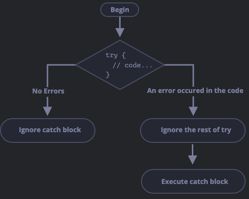

# Special functions

## Kernpunkte

- Was sind Arrow functions?
- Wie handhabe ich code fehler?
- Wie funktioniert try & catch?

## Arrow functions

Es gibt einen simpleren Functionssyntax durch `Arrow functions`

```js
let func = (arg1, arg2, ..., ArgN) => expression;
```

`Arrow functions` können wie reguläre Funktionen optionale argumente erhalten
(`arg1`,`arg2`, ...) und wertet die `expression` aus und `returned` das
Ergebnis.

Damit es eine kürzere Version von regulären Funktionen:

```js
let func = function(arg1, arg2, ..., argN) {
    return expression;
}
```

Beispiel:

```js
let sum = (a, b) => a + b;
/*short version of:
    let sum = function (a,b,) {
        return a + b;
    }
*/

console.log(sum(1, 2)); // function call - gibt 3 aus
```

Wenn wir keine Argumente übergeben bleiben die Klammern leer:

```js
let sayHi = () => console.log("Hello!");
sayHi(); // "Hello!";
```

Um auf das vorherige Array Beispiel mit der `forEach` method zurückzugreifen:

```js
let fruits = ["Apple", "Orange", "Plum"];

//fruit ist hier wieder ein placeholder Wort
fruits.forEach((fruit) => console.log(fruit));
//1. iteration - 'Apple'
//2. iteration - 'Orange'
//3. iteration - 'Pear'
```

`forEach` iteriert über das Array, mit `(fruit)` erhalten wir Zugriff
auf das Element, über das gerade iteriert wird (z.b "Apple").

Dieses Argument wird als Argument der `Arrow function` übergeben,
die dann die expression (`console.log(fruit)`) auswertet und das Element
in der Console ausgibt.

## Mutliline arrow functions

Manchmal benötigen wir komplexere Funktionen als nur eine Zeile.
Um eine Function mit mehreren Conditions und Statements auswerten zu
können, müssen wir einen function body eröffnen (`{...}`) und ein
explizites `return` schreiben, da die Arrow function dann nicht mehr
automatisch returned.

```js
let sum = (a, b) => {
  // erlaubt multiline function
  let result = a + b;
  return result; //explizites return
};
console.log(sum(1, 2)); //3
```

## Try...catch

Manchmal schreiben wir fehlerhaften code, haben unerwarteten input,
eine fehlerhafte server antwort oder irgendeine andere Fehlerquelle.

Wenn ein Fehler bei Ausführung eines Scripts passiert, 'stirbt' in der
Regel das script und es wird kein weiterer Befehl ausgeführt.

Um das zu vermeiden, gibt es einen `try...catch` syntax.

```js
try {
  //code
} catch (error) {
  //error handling
}
```

1. Zuerst wird der Code innerhalb des `try {}` body ausgeführt.
2. Wenn es keine Fehler gibt, wird `catch(error)` ignoriert. Der code
   erreicht das Endes des `try` bodys und überspringt den `catch` block.
3. Wenn ein Fehler passiert, dann stoppt der Code innerhalb des `try`
   statements und geht über zum `catch(error)` statement und führt den code
   innerhalb des `catch` bodys aus. Die `error` variable (kann beliebig genannt werden), enthählt ein `error object` mit den details darüber was schief gegangen ist.



So verhindern wir, dass unser script 'stirbt'
und der restliche code außerhalb des statements
weiterhin ausgeführt wird.

Ein Beispiel ohne Fehler:

```js
try {
  console.log("start"); //(1) -- "start"

  console.log("end"); //(2) -- 'end'
} catch (error) {
  console.log("An error occured"); // Wird nicht ausgeführt
}
```

Ein Beispiel mit Fehler:

```js
try {
  console.log("start"); //(1) -- "start"
  lalalala; //error, variable nicht definiert
  console.log("end"); //wird niemals ausgeführt
} catch (error) {
  console.log(`An error occured. They name of a error was ${error.name}`); //(2) -- fehler code wird ausgeführt
}
```

## Congrats that's it

Das war der gesamte Kurs. Feel free mit Beispielen in
[playgrounds](../intro.md#playgrounds) rumzuspielen, falls noch etwas unklar
ist.

Wir freuen uns auf den Sommer mit euch!


