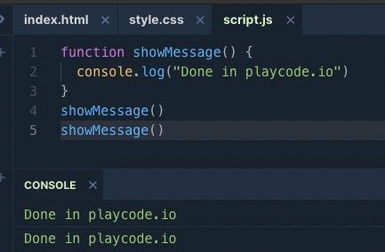
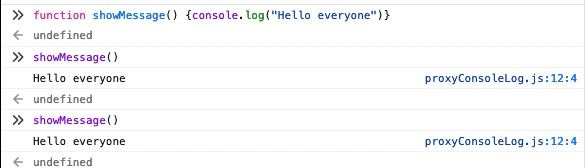

# Functions

## Kernpunkte

- Wie werden Funktionen deklariert?
- Was sind local & outer Variablen?
- Was sind Parameter?
- Wie funktioniert return?
- Was sollte man bei Funktionsnamen beachten?

## Functions Declaration

Funktionen sind Blöcke von code, der beliebig oft ausgeführt (gecalled) werden kann ohne den
eigentlichen code erneut schreiben/wiederholen zu müssen.

Wir haben bereits einige built-in functions kennengelernt `prompt` und `console.log`.
Nun werden wir unsere eigenen Functions schreiben.

Für `functions declarations` nutzen wir folgen Syntax:

```js
function showMessage() {
  console.log("Hello everyone!");
}
```

Zuerst benutzen wir das `function` keyword, gefolgt vom Namen der Funktion und eine Liste von
Parametern in den Klammern (hier erstsmal einmal leer gelassen - `()`).
Zwischen den geschwungenen Klammern (`{}`) befindet sich der `function body`, der unsere
Logik enthält - hier nur ein log statement.

```js
    function showMessage(parameter1, parameter2, ....moreParameter) {
        console.log(parameter1)
        //more code
    }
```

`parameter1` könnte hier zum beispiel eine dynamische Willkommensnachricht sein.
Nach dem wir eine Funktion definiert haben, können wir diese beliebig oft aufrufen.

```js
function showMessage() {
  console.log("Hello everyone");
}

showMesssage();
showMessage();
```

<details>
<summary>
In diesem Beispiel printen wir zweimal 'Hello everyone' in die console.
</summary>
 Playcode.io



Developer Console



</details>

:::tip DRY - Don't repeat yourself
Damit zeigen wir ebenfalls den Hauptsinn von Funktionen: code wiederholung zu vermeiden.

Wenn ihr merkt, dass ihr code wiederholt ist dies meist eine sehr eindeutige red flag,
dass ihr Dinge vermutlicht in eine Funktion auslagern könntet oder Probleme auf eine
andere Art und Weisen lösen solltet.
:::

## Local & outer variables

Eine wichtige Unterscheidung mit Funktionen sind `local` und `outer` variables.

`Local` variables sind nur innerhalb der Funktion sichtbar, z.B:

```js
function showMessage() {
  let message = "I'm stuck in a function, help!"; //local
  console.log(message);
}

showMessage(); // "I'm stuck in a function, help!" - in der console

console.log(message); // <--- Error! Die variable existiert nicht außerhalb der funktion.
```

Dies ist meist hilfreich wenn ihr sicherstellen wollt, dass bestimmte Informationen nur
innerhalb der Funktion verfügbar sein sollen und nicht ausversehen außerhalb der Funktion
verwendet werden.

`Outer` variablen hingegen können außerhalb _und_ innerhalb von Funktionen genutzt werden.

```js
let userName = "Haki";

function showMessage() {
  let message = "Hello," + username;

  console.log(message);
}

showMessage(); //Hello, Haki
```

Wir können den Wert von `outer` variables auch innerhalb einer Funktion updaten:

```js
let userName = "Haki";
function showMessage() {
  userName = "HSAKA"; // wert geupdated

  let message = "Hello, " + userName;
  console.log(message);
}

console.log(userName); // Haki - vor dem Funktionsaufruf

showMessage(); // Hello, HSAKA

console.log(username); // HSAKA, durch den Funktionsaufruf ist unser variablenwert permanent verändert
```

Falls Variablennamen doppelt vergeben werden (außerhalb und innerhalb einer Funktion -
was aufgrund ihrer unterschiedlichen [scopes](https://javascript.info/closure) möglich ist)
wird die lokale variable verwendet.

```js
let userName = "Haki";

function showMessage() {
  let userName = "HSAKA"; // deklarieren hier eine local variable

  let message = "Hello, " + userName; // "Hello HSAKA"
  console.log(message);
}

// die funktion verwendet ihre lokale variable - username
showMessage();

console.log(userName); // Haki, unverändert, die funktion hat die outer variable nicht verändert.
```

:::danger Mix ups
Wir decken dieses Verhalten ab, damit ihr euch dieses Verhaltens bewusst seid.
Generell wird das updaten von `outer` variables anhand von Funktionen.

In größeren Projekten/Files sorgt dies schnell für Verwirrung, da nicht immer klar ist,
welchen Wert eine Variable zu einem bestimmten Zeitpunkt hat und es leicht zu Verwechselungen kommen kann,
die besonders bei der Fehlersuche sowie Maintenance innerhalb des codes sehr frustrierend
sein kann.
:::

## Parameters

Parameter erlauben es und Funktionen Werte/Daten zu übermitteln.

```js
function showMessage(from, text) {
  //parameter: from, text
  console.log(`from: ${text}`); // template strings - Part1/Types
}

showMessage("Ann", "Hello!"); // Ann: Hello! *
showMessage("Ann", "What's up?"); // Ann: What's up? **
```

Die Funktion `showMessage` wird mit den `strings` gecalled und kopiert (in der Zeile mit \* und \*\*)
den Wert der Strings in die parameter (`from` und `text` in der Reihenfolge wie sie
der Funktion übergeben werden). Erst dann wird die Funktion ausgeführt.

Hier ein weiteres Beispiel:

```js
function showMessage(from, text) {
  from = `* ${from} *`; // dekoration für den string

  console.log(`${from}: ${text}`);
}

let from = "Ann";

showMessage(from, "Hello"); // *Ann*: Hello

console.log(from); //Ann
// Der Wert von `from` ist nach wie vor der alte, da beim function call eine lokale kopie
// erstellt wird - die parameter.
```

Begrifflichkeiten: Oftmals werden bei Funktionen die Begriffe `Parameter` und
`Argument` synonym verwendet.

- Parameter werden bei der function declaration angegeben (in den klammern) und ist ein
  Deklarationsbegriff

- Argumente werden der Funktion übergeben, wenn sie aufgerufen (gecalled) wird und ist ein call
  time begriff

Wir deklarieren funktionen indem wir ihre Parameter definieren und callen die Funktion in dem
wir ihr Argumente übergeben.

:::tip Parameternamen und Argumente

Die mehrfache Verwendung des gleichen Namens zur deklaration mehrerer Variablen
(local und outer) sollte generell vermieden da es schnell zu Verwechselungen kommen kann.

Die gleichen Namen können jedoch bei Parametern und Argumenten verwendet werden, da
es sich bei Parametern um _lokale kopien_ von Argumenten handelt.

Dies macht es intuitiv mit den variablen zu arbeiten, es besteht keine Verwirrung
welche Daten sich innerhalb der Variablen befinden und aufgrund der Kopie ist
das versehentliche Updaten des Urpsrungswerts ebenfalls nicht möglich.

:::

## Default Values

Wenn eine function gecalled wird, aber ihr kein `Argument` übergeben wurde,
dann werden den `Parametern` `undefined` übergeben.

```js
showMessage("Ann"); // "*Ann*: undefined"
```

Mit der oben genannten Funktion würde der Wert `from` "Ann" übernehmen, während `text`
leer bleiben würde:

Falls wir nicht wissen, ob unsere `Argumente undefined` sein werden, können wir
dies auf verschiedenen Formen handhaben.

Wir können default werte deklarieren:

```js
function showMessage(from, text = "text missing") {
  console.log(`*${from}*: ${text}`);
}
showMessage("Ann"); // *Ann*: text missing
```

`text missing` wird nun jedes mal anstelle von `undefined` assigned, falls kein 2. Parameter
übergeben wird.

Dies ist natürlich ebenfalls mit komplizierten assigments möglich:

```js
function showMessage(from, text = anotherFunction()) {
  // anotherFunction() wird gecalled, wenn kein 2. Parameter übergeben wird
}
```

Eine andere Möglichkeit wäre einen logischen Operator oder ein `if` statement zu verwenden:

```js
function showMessage(text) {
  if (text === undefined) {
    //wenn parameter fehlt
    text = "empty message";
  }
  console.log(text);
}
showMessage(); //empty message
```

**Oder**

```js
function showMessage(text) {
  console.log(text ?? "Empty message");
}
showMessage(); //Empty message
```

[Nullish coalescing](../part-two/conditionals#nullish-coalescing-operator-) bietet in solchen
Fällen eine elegante Lösung für fehlende Werte zu kompensieren.

## Return values

Funktionen geben immer einen Wert zurück, der `return value` genannt wird.
Bei den oberen Funktionen haben wir keinen Rückgabewert definiert, weshalb diese Funktionen
`undefined` zurückgeben.


In dem Beispiel wird zuerst die funktion gecalled und ausgeführt (`Hallo`) und gibt dann den
return value in der console aus `undefined`

Mit dem keyword `return` können wir gezielt Werte zurückgeben, beispielsweise bei Rechnungen:

```js
function sum(a, b) {
  return a + b;
}

let result = sum(1, 2);
console.log(result); // 3
```

`return` kann überall innerhalb eines function body geschrieben werden, wenn das Programm
diese Zeile erreicht, stoppt die Funktion und gibt diesen Wert zurück.

```js
function calculateFee(isMember) {
  if (isMember) {
    return 20;
  } else {
    return 50;
  }
}

let isMember = confirm("Are you a member?");

const fee = calculateFee(isMember);
console.log(`Your fee is :${fee}`);
```

Hier überprüfen wir den Mitgliedsstatus einer Person, geben basierend auf ihres Status
(`boolean`) unterschiedliche Kosten zurück und geben diese per console aus.

:::caution Zeilenumbruch bei return
`return` gibt nur den Wert auf der gleichen Zeile zurück. Falls ein sehr langer Wert
zurückgeben werden soll, dann könnt ihr Klammern verwenden, andernfalls gibt `undefined`
oder nur Teile des Wertes zurück.

```js
return; //returns undefined
some * long * expression;

return (
  some * long * expression //returns intended value
);

return 5; // returns 5
```

:::

:::tip Early returns

Best practice: Bei vielen conditionals in einer Funktion mit unterschiedlichen `return` values.
Können frühre `return` statements die Lesbarkeit von Funktionen erleichtern.
Anstatt die komplette Funktion bis zum Ende lesen zu müssen können lesende Personen
bis zu dem passenden conditional lesen und sich den Rest der Funktion ersparen.

Ein ausführliches [Beispiel](https://jamesmonger.com/2019/08/06/return-early-return-often.html).
:::

## Naming a function

**Funktionen sind Aktionen**.

Deshalb sollten ihre Namen in der Regel ein Verb sein. Vergleichbar mit
[Variablennamen](../part-one/naming.md), sollten Funktionsnamen kurz, akkurat, deskpritiv sein
und eine Aussage darüber tätigen was die Funktion macht.

z.B.:

Funktionsanfänge:

- `get...` - gib einen Wert zurück
- `calc...` - berechne etwas & gib den Wert zurück
- `create...` - erstelle etwas
- `check...` - kontrolliere/checke etwas & gib ein `boolean` zurück

Weitere Beispiele:

- `showMessage(..)` - shows a message
- `getAge(..)` - returns the age (gets it somehow)
- `calcSum(..)` - calculates a sum and returns the result
- `createForm(..)` - creates a form (and usually returns it)
- `checkPermission(..)` - checks a permission, returns true/false

:::tip One function = one action
Generell sollte eine Funktion nur das tun was ihr Name aussagt und nicht mehr.

    Um dies umzusetzen sollte eine Funktion auch nur eine Aktion umsetzen.
    Sollten mehrere Aktionen notwendig sein, so können mehre Funktionen erstellt werden.

    Dies hilft automatisch dabei euren Code zu fragmentieren und damit maitenance sowie
    debugging einfacher zu gestalten.

    Bei vielen einzelnen Funktionen ist es leichter die Fehlerquelle zu isolieren oder
    Teile des codes zu verbessern/updaten, weil sie vielleicht outdated sind.

:::

## Functions are comments

Durch das aufsplitten von Aktionen über mehrere Funktionen dokumentieren wir gleichzeitig unseren
code.

Es erleichtert maitenance, spätere upgrades oder verbesserungen wenn viele einzelne Funktionen
zu pflegen sind statt eine große Funktion.

Deskpritive Funktionsnamen helfen Personen beim ersten überfliegen des codes den groben
Ablauf des codes besser zu verstehen und Prozesse ausmachen zu können.

Ein Beispiel zwischen zwei Funktionen - beide printen Primzahlen bis zur number `n`.

(Die erste Function nutzt ein [label](https://developer.mozilla.org/de/docs/Web/JavaScript/Reference/Statements/label)
(`nextPrime`) um mit `continue` die nächste iteration des äußeren loops zu triggern)

```js
function showPrimes(n) {
  nextPrime: for (let i = 2; i < n; i++) {
    for (let j = 2; j < i; j++) {
      if (i % j == 0) continue nextPrime;
    }

    console.log(i); // a prime
  }
}
```

**vs**

```js
function showPrimes(n) {
  for (let i = 2; i < n; i++) {
    if (!isPrime(i)) continue;

    console.log(i); // a prime
  }
}

function isPrime(n) {
  for (let i = 2; i < n; i++) {
    if (n % i == 0) return false;
  }
  return true;
}
```

Die Aufteilung in zwei Funktionen ist deutlich lesbarer und die selbst-beschreibenden
Namen verdeutlichen, welche Funktion welchen Logikteil übernimmt.

Darüber hinaus geben uns mehrere Funktionen mit kleineren Schritten eine bessere Chance
die Funktionen an anderer Stelle wiederzuverwenden, weil sie die gleiche Teilproblematik
lösen.

## Coding

Wir setzen hier unser FizzBuzz Script fort:

:::note Unabhängige Aufgaben
Falls ihr unabhängige [Aufgaben](https://javascript.info/while-for#tasks) mit
Lösungen möchtet - nutzt hierfür gerne die genannten [playgrounds](../intro#playgrounds)
:::

### Teil 1:

Unser Script funktioniert super! Doch was ist wenn wir neue conditions hinzufügen sollen
oder für andere Zahlen kontrollieren sollen?

Um den code lesbarer zu machen möchten wir eine Funktion schreiben, die Logik
etwas aus dem Loop entfernt und es uns ermöglicht einfach mehrmals die Funktion aufzurufen.

Die Bedingungen bleiben wir gehabt:

- Zahlen, die durch `3` teilbar sind geben den String `Fizz` aus
- Zahlen, die durch `5` teilbar sind geben den String `Buzz` aus
- Zahlen, die durch `3` und `5` teilbar sind geben den String `FizzBuzz` aus
- Falls die Zahl nicht teilbar ist, gib den Wert der Zahl aus

<details>
<summary>Mögliche Lösung Teil 1</summary>

```js
//jshint esnext:true

function hasNoRemainder(input, a) {
  return input % a === 0;
}
//Diese Funktion erhält einen Input und eine Zahl durch die sie teilen soll.
//Wir erhalten durch das eine `boolean` (true or false) das wir mit `return` zurückgeben
//und wir in `If statements` nutzen können.

for (let i = 1; i <= 100; i++) {
  //loop bis 100 in 1er Schritten
  let output = ""; // Wir deklarieren einen leeren string, der updatebar ist
  if (hasNoRemainder(i, 3)) {
    //condition 1
    output += "Fizz";
    // Wir updaten die output variable durch das anhängen von "Fizz"
    // += ist dabei eine Abkürzung für: output = output + "Fizz"
  }
  if (hasNoRemainder(i, 5)) {
    //condition 2
    output += "Buzz"; //Wir updaten hier wieder und hängen "Buzz" an
  }

  console.log(output === "" ? i : output);
  // Wir checken mit einem conditional operator, ob der string leer ist und geben
  // je nach dem in der console entweder die Zahl(i) oder den String(output) aus
}
```

</details>

### Teil 2:

Wir müssen leider immer noch einiges per Hand ausbessern, am besten wäre es wenn wir
den gesamten Loop als wiederverwenbare Funktion nutzen könnten, um mehrere Zahlen
relativ einfach hintereinander kontrollieren zu können.

Bette den Loop in eine Funktion ein um die folgenden zwei Sets an Bedingungen
durch zwei Funktionsaufrufe relativ einfach testen zu können:

Die alten Bedingungen:

- Zahlen, die durch `3` teilbar sind geben den String `Fizz` aus
- Zahlen, die durch `5` teilbar sind geben den String `Buzz` aus
- Zahlen, die durch `3` und `5` teilbar sind geben den String `FizzBuzz` aus
- Falls die Zahl nicht teilbar ist, gib den Wert der Zahl aus

Die neuen Bedingungen

- Zahlen, die durch `4` teilbar sind geben den String `Fizz` aus
- Zahlen, die durch `7` teilbar sind geben den String `Buzz` aus
- Zahlen, die durch `4` und `7` teilbar sind geben den String `FizzBuzz` aus
- Falls die Zahl nicht teilbar ist, gib den Wert der Zahl aus

<details>
<summary>Mögliche Lösung Teil 2</summary>

```js
//jshint esnext:true

function hasNoRemainder(input, a) {
  return input % a === 0;
}

function fizzBuzz(a, b) {
  //Wir wrapen den gesamten loop in eine function, der zwei Parameter übergeben werden kann
  //und tauschen die vorherigen Zahlen mit diesen Parametern aus

  for (let i = 1; i <= 100; i++) {
    //loop bis 100 in 1er Schritten
    let output = ""; // Wir deklarieren einen leeren string, der updatebar ist
    if (hasNoRemainder(i, a)) {
      //condition 1
      output += "Fizz";
      // Wir updaten die output variable durch das anhängen von "Fizz"
      // += ist dabei eine Abkürzung für: output = output + "Fizz"
    }
    if (hasNoRemainder(i, b)) {
      //condition 2
      output += "Buzz"; //Wir updaten hier wieder und hängen "Buzz" an
    }
    console.log(output === "" ? i : output);
    // Wir checken mit einem conditional operator, ob der string leer ist und geben
    // je nach dem in der console entweder die Zahl(i) oder den String(output) aus
  }
}

fizzBuzz(3, 5);
fizzBuzz(4, 7);
//Zum Schluss rufen wir diese funktion mit den gewünschten Parametern auf
```

</details>
