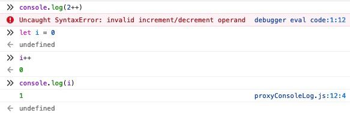

import Tabs from "@theme/Tabs";
import TabItem from "@theme/TabItem";

# Loops

## Kernpunkte

- Was sind 'while' loops?
- Was sind 'do while' loops?
- Wie funktionieren 'for loops'?
- Wie unterbreche ich loops?
- Wie starte ich die nächste loop iteration?

## The 'while' loop

Mit einem `while` Loop können wir Code solange ausführen, bis eine Bedingung `false` wird - oder anders gesagt, solange die Bedingung `true` ist (`while` it is `true`).

```js
let condition = true;
while (condition) {
  condition = false; //updaten die condition zu false und verhindern so eine loop wiederholung
  //der bereich innerhalb der { } Klammern wird "loop-body" genannts
}
```

Solange die `condition` `truthy` ist wird der code innerhalb des "loop-body" ausgeführt.

```js
let iteration = 0;
while (iteration < 3) {
  //ist zuerst 0, dann 1, dann 2
  console.log(iteration);
  itertation++; // addieren hier '1' zu der variable hinzu
}
```

:::info Increment by one - short hand
`variable++` ist eine Abbkürzung für `variable = variable + 1`

Da es eine Abkürzung für Variablenassigment ist funktioniert dies nur mit variablen, `2++` würde beispielsweise einen Syntaxfehler werfen.

Nach `i++` wird `0` züruckgegeben, weil das der `return value` von `i` vor der Erhöhung ist.


:::

Eine einmalige Ausführung des loop-body wird _iteration_ genannt.

Das oben genannt Beispiel macht drei iterations, bei der die `iteration` variable jedes mal um eins
erhöht wird bis die condition `falsy` ist und damit der Loop beendet ist.

Würden wir die Variable nicht jedes Mal um eins erhöhen (`iteration++`), würde der loop-body
theoretisch undendlich oft ausgeführt, da die condition für immer `truthy` wäre.

## 'do while' loop

Falls wir einen gewissen Abschnitt mindestens einmal ausführen wollen - unabhängig von dem eigentlichen Loop - gibt es hierfür den `do..while` syntax:

```js
do {
  //einmaliger loop body
} while (condition);
```

Der Code innerhalb der geschwungen Klammern (`{}`) des `do` Loops wird einmal ausgeführt
und danach geprüft, ob die condition für den `while` Loop immer noch erfüllt ist.

## 'for' loop

Der `for` loop ist etwas komplexer und lässt sich in diese Schritte einteilen:

```js
for (begin; condition; step) {
  //loop-body
}
```

In `begin` können wir eine temporäre Variable deklarieren (die variable steht uns nur während des
for loops zur Verfügung und nicht außerhalb, dies hängt mit ihrem scope zusammen. [Hier](https://www.w3schools.com/js/js_scope.asp) und [hier](https://javascript.info/closure) könnt ihr mehr
darüber lesen ). Als Beispiel wählen wir `let i = 0`.

In der `condition` legen wir fest an welche Bedingung der Loop geknüpft werden soll  - hier `i < 3`. Sobald diese Bedingung nicht mehr wahr ist, wird der Loop beendet.

`step` erwartet ein Stück Code, welches **nach** jeder Iteration des Loops ausgeführt wird - hier nehmen wir `i++` um unsere Loopvariable um eins zu erhöhen.

```js
// zeigt 0, dann 1, dann 2
for (let i = 0; i < 3; i++) {
  console.log(i);
}
```

<Tabs>
  <TabItem value="begin" label="begin" default>
    Variable wird deklariert beim 'betreten' des loops
  </TabItem>
  <TabItem value=" condition" label="condition" default>
    Wird vor jeder loop *iteration* gechecked und stoppt den loop, falls falsy
  </TabItem>
  <TabItem value="loop-body" label="loop-body" default>
    Wird ausgeführt solange die condition truthy ist.
  </TabItem>
  <TabItem value="step" label="step" default>
    Wird nach jeder abgeschlossenen Ausführung des loop-body ausgeführt.
  </TabItem>
  <TabItem value='ablauf' label='Visueller Ablauf' default>

        Iteration beginnt

      → (if condition → run body and run step)

      → (if condition → run body and run step)

      → (if condition → run body and run step)

      → ...

  </TabItem>
</Tabs>

## Breaking the loop

Normalerweise stoppt ein Loop, wenn seine condition nicht mehr zutrifft.
Es gibt jedoch ebenfalls die Möglichkeit einen loop direkt zu stoppen - mit `break`

```js
let sum = 0;

while (true) {
  let value = prompt("Enter a number", "");

  if (!value) {
    break; // breaks loop
  }

  sum = sum + value;
}
console.log(`Sum: ${sum}`);
```

Wir fragen einen user nach Zahlen (`prompt`), diese werden in der `value` Variable gespeichert,
solange wir Zahleninputs erhalten, addieren wir diese zu `sum` hinzu.

Dies passiert solange bis wir keinen Zahleninput mehr erhalten `if (!value)`, dort wird
der loop abgebrochen und wir geben die Summe aller addierten Zahlen aus `console.log("Sum: " sum)`

## Continuing the loop

Das `continue` keyword ist die kleine Schwester des `break` keywords.

Anstatt einen Loop komplett zu stoppen, stoppt `continue` nur die aktuelle iteration und springt direkt in die nächste _iteration_ des loops - `step`
wird hierbei trotzdem ausgeführt.

Dies ist sinnvoll, falls wir nicht den kompletten loop-body durchlaufen lasen möchten.

Hier ein beispiel mit [remainder](../part-one/operands#mathoperands):

```js
for (let i = 0; i < 10; i++) {
  if (i % 2 === 0) {
    // if true, skip das console.log statement
    continue;
  }
  console.log(i); // 1, 3, 5, 7, 9
}
```

## Coding

Wir setzen hier das Script aus dem vorherigen Teil fort.

:::note Unabhängige Aufgaben
Falls ihr unabhängige [Aufgaben](https://javascript.info/while-for#tasks) für Loops mit
Lösungen möchtet - nutzt hierfür gerne die genannten [playgrounds](../intro#playgrounds)
:::

### Teil 1:

Anstatt den String für eine feste Inputvariable zu bekommen, sollen wir nun die Strings
für alle Zahlen zwischen 1 bis 100 ausgeben.
Die gleichen Conditionen gelten:

- Zahlen, die durch `3` teilbar sind geben den String `Fizz` aus
- Zahlen, die durch `5` teilbar sind geben den String `Buzz` aus
- Falls die Zahl nicht teilbar ist, gib den Wert der Zahl aus

<details>
<summary>Mögliche Lösung Teil 1</summary>

```js
//jshint esnext:true

for (let i = 1; i <= 100; i++) {
  //loop bis 100 in 1er Schritten
  if (i % 3 === 0) {
    //condition 1
    console.log("Fizz");
    continue; //starte die nächste iteration
  }
  if (i % 5 === 0) {
    //condition 2
    console.log("Buzz");
    continue; //starte die nächste iteration
  }
  console.log(i); // gib die Zahl aus
}
```

</details>

### Teil 2:

Manchen ist bestimmt aufgefallen, dass manche Zahlen durch `3` und `5` teilbar sind,
wir bei diesen bisher jedoch nur `Fizz` ausgeben.

Das möchten wir ändern.
Falls eine Zahl durch beide Zahlen (`3` und `5`) teilbar ist, soll diese `FizzBuzz` ausgeben.

<details>
<summary>Mögliche Lösung Teil 2</summary>

```js
//jshint esnext:true

for (let i = 1; i <= 100; i++) {
  //loop bis 100 in 1er Schritten
  if (i % 3 === 0 && i % 5 === 0) {
    // condition 3
    console.log("FizzBuzz");
    continue; //starte die nächste iteration
  }

  if (i % 3 === 0) {
    //condition 1
    console.log("Fizz");
    continue; //starte die nächste iteration
  }
  if (i % 5 === 0) {
    //condition 2
    console.log("Buzz");
    continue; //starte die nächste iteration
  }
  console.log(i); // gib die Zahl aus
}
```

Eine weitere Lösung mit einem
[conditional operator](../part-two/conditionals#conditional-operator-) wäre:

```js
for (let i = 1; i <= 100; i++) {
  //loop bis 100 in 1er Schritten
  let output = ""; // Wir deklarieren einen leeren string, der updatebar ist
  if (i % 3 === 0) {
    //condition 1
    output += "Fizz";
    // Wir updaten die output variable durch das anhängen von "Fizz"
    // += ist dabei eine Abkürzung für: output = output + "Fizz"
  }
  if (i % 5 === 0) {
    //condition 2
    output += "Buzz"; //Wir updaten hier wieder und hängen "Buzz" an
  }
  console.log(output === "" ? i : output);
  // Wir checken mit einem conditional operator, ob der string leer ist und geben
  // je nach dem in der console entweder die Zahl(i) oder den String(output) aus
}
```

</details>
